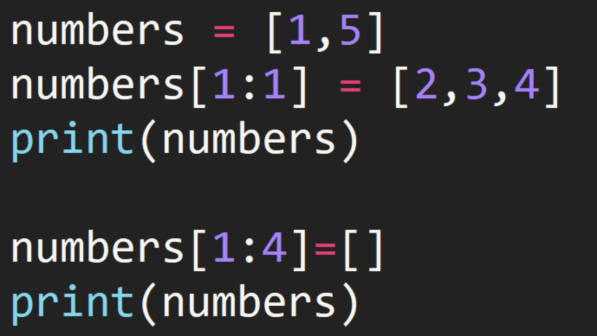
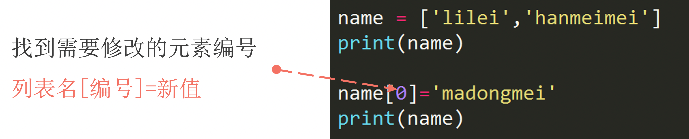
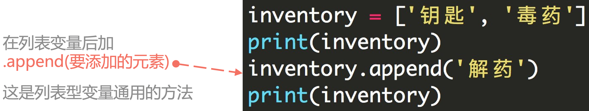
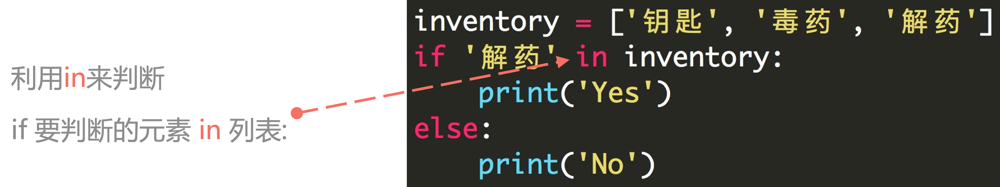
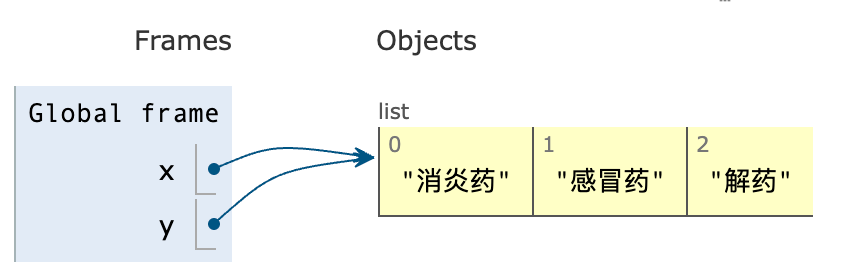
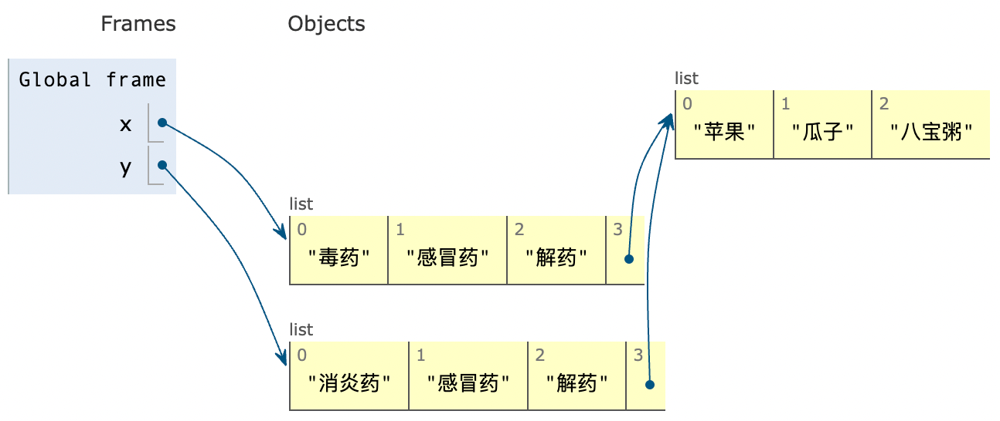
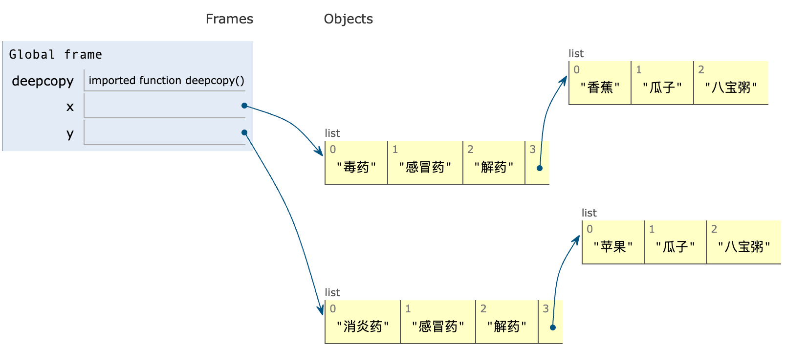

## 1. 列表结构

- 利用 **<span style="color:orange">中括号</span>** 表示列表
- 列表内的元素用 **<span style="color:orange">逗号</span>** 隔开
- 注意是 **<span style="color:orange">英文输入法</span>** 下的逗号

```python
student1 = ['lilei', 18, 'class01', 201901]
student2 = ['hanmeimei', 19, 'class02', 201902]
```

列表的 **<span style="color:orange">可变性</span>**：可以修改列表里的内容。

- 字符串强制转换成列表

```python
string_to_list = list('Bornforthis')
print(string_to_list)

# ---output---
['B', 'o', 'r', 'n', 'f', 'o', 'r', 't', 'h', 'i', 's']
```

## 2. 获取列表中的某个元素

### 2.1 列表下标的组成

编程语言中通常 **<span style="color:orange">第一个位置的编号是 0</span>**。


### 2.2 提取单个元素

中括号内数字指定元素位置。

```python
grade = [98, 99, 95, 80]
print(grade[0])  # 98
print(grade[0] + grade[3])  # 178
```

### 2.3 获取列表中连续的几个元素


- 中括号内用 **<span style="color:orange">起始位置:结束位置</span>** 描述
- **注意：** 不包括结束位置的元素。

```python
numbers = [0, 1, 2, 3, 4, 5, 6, 7, 8, 9]
print(numbers[2:6])  # [2, 3, 4, 5]
```

### 2.4 获取列表中连续且特定间隔的元素


- 更细致的用法 **<span style="color:orange">起始位置:结束位置:步长</span>**
- **注意：** 不包括结束位置的那个元素

```python
numbers = [0, 1, 2, 3, 4, 5, 6, 7, 8, 9]
print(numbers[1:7:2])  # [1, 3, 5]
```


## 3. 列表的切片赋值

::: tabs

@tab Code


@tab Think


:::

```python
In [1]: name = 'Python'

In [2]: lst = list(name)

In [3]: lst
Out[3]: ['P', 'y', 't', 'h', 'o', 'n']

In [4]: lst[2:]
Out[4]: ['t', 'h', 'o', 'n']

In [5]: list('abc')
Out[5]: ['a', 'b', 'c']

In [6]: lst[2:] = list('abc')

In [7]: lst
Out[7]: ['P', 'y', 'a', 'b', 'c']
```



```python
In [8]: numbers = [1, 5]

In [9]: numbers[1:1]
Out[9]: []

In [10]: numbers[1:1] = [2, 3, 4]

In [11]: numbers
Out[11]: [1, 2, 3, 4, 5]

In [12]: numbers[1:4] = []

In [13]: numbers
Out[13]: [1, 5]
```

## 4. 小试牛刀

获取用户输入两个值，一个是要插入的位置，一个是要插入这个位置的值。

给定下面列表：

```python
numbers = [1, 2, 3, 5, 6]
```

**例子：**

```python
Enter position: 3
Enter value: 4
[1, 2, 3, 4, 5, 6]
```

> 不能使用 `.insert()`

:::: details Solution

::: code-tabs

@tab Code1

```python
numbers = [1, 2, 3, 5, 6]
position = int(input('Enter position: '))
value = int(input('Enter value: '))
numbers[position: position] = [value]
print(numbers)
```

@tab Code2

```python
numbers = [1, 2, 3, 5, 6]
position = int(input('Enter position: '))
value = int(input('Enter value: '))
result = numbers[:position] + [value] + numbers[position:]
print(result)
```

:::

::::

## 5. 在列表的特定位置插入元素「`.insert(index, element)`」

`.insert(index, element)` 是一个列表的基本方法，用于在列表的指定位置插入一个元素。

它的基本语法是：

```python
list.insert(index, element)
```

- `index`: 指定要插入元素的位置。索引从 0 开始。如果指定的索引超出了列表的当前长度「不会报错」，则元素将被添加到列表的末尾。
- `element`: 这是你想要插入列表的元素。

```python
numbers = [1, 2, 3, 5, 6]
numbers.insert(3, 4)
print(numbers)  # [1, 2, 3, 4, 5, 6]
```


## 6. 列表长度

获取列表长度，使用 `len()`:

```python
student_list = ['李雷', '韩梅梅', '马冬梅']
print(len(student_list))

# ---output---
3
```

## 7. 修改列表中的元素



1. 单个元素修改

```python
name = ['lilei', 'hanmeimei']
print('before:', name)

name[0] = 'madongmei'
print('after:', name)


# ---output---
before: ['lilei', 'hanmeimei']
after: ['madongmei', 'hanmeimei']
```

2. 多个元素修改

::: code-tabs

@tab 修改元素数量一样

```python
numbers = [0, 1, 2, 3, 4, 5, 6, 7, 8, 9, 10]
print('before:', numbers)

numbers[1:5] = ['one', 'two', 'three', 'four']
print('after:', numbers)

# ---output---
原本: [0, 1, 2, 3, 4, 5, 6, 7, 8, 9, 10]
修改后: [0, 'one', 'two', 'three', 'four', 5, 6, 7, 8, 9, 10]
```

@tab 修改改元素数量不一样

```python
numbers = [0, 1, 2, 3, 4, 5, 6, 7, 8, 9, 10]
print('before:', numbers)

# 元素数量不一样
numbers[1:5] = ['one', 'two']
print('after:', numbers)

# ---output---
before: [0, 1, 2, 3, 4, 5, 6, 7, 8, 9, 10]
after: [0, 'one', 'two', 5, 6, 7, 8, 9, 10]
```

:::


3. 多个修改的对象也可以是字符串

```python
numbers = [0, 1, 2, 3, 4, 5, 6, 7, 8, 9, 10]
print('before:', numbers)

# 元素数量不一样 & 字符串自动拆开成列表
numbers[1:5] = 'bornforthis'
print('after:', numbers)

# ---output---
before: [0, 1, 2, 3, 4, 5, 6, 7, 8, 9, 10]
after: [0, 'b', 'o', 'r', 'n', 'f', 'o', 'r', 't', 'h', 'i', 's', 5, 6, 7, 8, 9, 10]
```

- 多个元素修改情况下，可以使用的对象：

    - 列表
    - 元组
    - 集合
    - 字符串
    - 字典「放进去的是 key」

```python
numbers = [0, 1, 2, 3, 4, 5, 6, 7, 8, 9, 10]
print('before:', numbers)

numbers[1:5] = {'a': 1, 'b': 8}
print('after:', numbers)

# ---output---
before: [0, 1, 2, 3, 4, 5, 6, 7, 8, 9, 10]
after: [0, 'a', 'b', 8, 9, 10]
```

- 多个元素修改情况下，不可以的对象：

    - 布尔型


```python
numbers = [0, 1, 2, 3, 4, 5, 6, 7, 8, 9, 10]
print('before:', numbers)

numbers[1:5] = True
print('after:', numbers)

# ---output---
原本: [0, 1, 2, 3, 4, 5, 6, 7, 8, 9, 10]
Traceback (most recent call last):
  File "/Users/huangjiabao/GitHub/iMac/Pycharm/StudentCoder/44-liuchengyang/demo.py", line 4, in <module>
    numbers[1:5] = True
TypeError: can only assign an iterable
```


## 8. 向列表添加元素

### 8.1 添加单个元素「`.append()`」



```python
lst = ['钥匙', '毒药']
print('before:', lst)
lst.append('解药')
print('after:', lst)

# ---output---
before: ['钥匙', '毒药']
after: ['钥匙', '毒药', '解药']
```

### 8.2 添加多个元素「`.extend()`」

```python
inventory = ['钥匙', '毒药', '解药']
inventory.extend(['迷药', '感冒药'])
print(inventory)

# ---output---
['钥匙', '毒药', '解药', '迷药', '感冒药']
```

## 9. 删除列表中的元素

### 9.1 del

del 需要指定列表中要删除的单个元素或多个元素，如果不指定元素，则删除整个变量。

```python
student_list = ['李雷', '韩梅梅', '马冬梅']
del student_list[0]
print(student_list)

# ---output---
['韩梅梅', '马冬梅']
```

如果不指定删除的元素，则删除整个变量。

```python
student_list = ['李雷', '韩梅梅', '马冬梅']
del student_list
print(student_list)

# ---output---
Traceback (most recent call last):
  File "/Users/huangjiabao/GitHub/iMac/Pycharm/StudentCoder/39-YDN/HW1/hw1_q7.py", line 3, in <module>
    print(student_list)
NameError: name 'student_list' is not defined
```


### 9.2 pop()

`pop()` 函数默认删除列表中的最后一个元素，也可以传参数指定要删除元素的下标。

```python
student_list = ['李雷', '韩梅梅', '马冬梅']
student_list.pop()  # 默认删除最后一个
print(student_list)

student_list.pop(0)  # 删除 student_list 的 0 号位
print(student_list)


# ---output---
['李雷', '韩梅梅']
['韩梅梅']
```

### 9.3 remove()

`remove()` 指定删除列表中某个元素，例如:`remove('aiyc')` 则指定删除列表中的 `'aiyc'` 元素。

```python
student_list = ['李雷', '韩梅梅', '马冬梅']
student_list.remove('韩梅梅')
print(student_list)

# ---output---
['李雷', '马冬梅']
```

## 10. 两个列表相加

直接使用加号加就可以。

```python
numbers1 = [0, 1, 2, 3, 4]
numbers2 = [5, 6, 7, 8, 9]
print(numbers1 + numbers2)

# ---output---
[0, 1, 2, 3, 4, 5, 6, 7, 8, 9]
```

## 11. 判断某个元素是否存在于列表中「Value in Sequence」



```python
inventory = ['钥匙', '毒药', '解药']
print('解药' in inventory)
print('迷药' in inventory)

# ---output---
True
False
```

## 12. 获取列表中某个元素重复的次数「.count()」

```python
numbers = [0, 1, 1, 2, 3, 4, 1]
print(numbers.count(1))

# ---output---
3
```

## 13. 获取列表中某个元素第一次出现的位置「.index()」

- 用 **<span style="color:orange">列表.index(元素)</span>** 来获取，如果元素不存在则会报错。

```python
numbers = [0, 1, 1, 2, 3, 4, 1]
print(numbers.index(1))  # 1
```

## 14. 列表排序

### 14.1 sort(reverse=False)

`list.sort()` 使列表内的元素从小大排列，直接修改列表本身。如果里面指定 `reverse=True` 则列表降序排列。

```python
numbers = [2, 1, 4, 3, 7, 6, 5, 0, 9, 8]
numbers.sort()
print(numbers)  # [0, 1, 2, 3, 4, 5, 6, 7, 8, 9]

numbers = [2, 1, 4, 3, 7, 6, 5, 0, 9, 8]
numbers.sort(reverse=True)
print(numbers)  # [9, 8, 7, 6, 5, 4, 3, 2, 1, 0]
```

### 14.2 sorted(list, reverse=False)

`sorted(list, reverse=False)` 将列表进行小到大排序，排序后原列表不变，返回新列表。`reverse` 默认 False，如果设置为 True 则返回降序排序。

::: code-tabs

@tab Code1

```python
lst = [9, 8, 10, 7, 6, 5, 4, 3, 2, 1, 0]
new_lst = sorted(lst)
print(new_lst)  # [0, 1, 2, 3, 4, 5, 6, 7, 8, 9, 10]
```

@tab reverse=True

```python
lst = [9, 8, 10, 7, 6, 5, 4, 3, 2, 1, 0]
new_lst = sorted(lst, reverse=True)
print(new_lst)  # [10, 9, 8, 7, 6, 5, 4, 3, 2, 1, 0]
```

:::


### 14.3 练习

- 将一串字符串 `'132569874'` 转换成列表并将其输出；
- 对其中偶数下标的元素进行降序排列，奇数下标的元素不变。

```python
str_to_list = list('132569874')
print(str_to_list)
even_position = str_to_list[::2]
even_position.sort(reverse=True)
str_to_list[::2] = even_position
print(str_to_list)

# ---output---
['1', '3', '2', '5', '6', '9', '8', '7', '4']
['8', '3', '6', '5', '4', '9', '2', '7', '1']
```

## 15. reverse()

反转列表中的元素。

```python
lst = ['毒药', '解药', '感冒药']
lst.reverse()
print(lst)  # ['感冒药', '解药', '毒药']
```


## 16. 列表的深浅拷贝

### 16.1 所存在的问题

::: code-tabs

@tab Code1

```python
x = ['毒药', '感冒药', '解药']
y = x
print(f'Original:\n\tx: {x}\n\ty: {y}\n\tid_x: {id(x)}\tid_y:{id(y)}')  # id 用来获取变量的物理地址
y[0] = '消炎药'
print(f'After:\n\tx: {x}\n\ty: {y}\n\tid_x: {id(x)}\tid_y:{id(y)}')


# ---output---
Original:
	x: ['毒药', '感冒药', '解药']
	y: ['毒药', '感冒药', '解药']
	id_x: 4470743680	id_y:4470743680
After:
	x: ['消炎药', '感冒药', '解药']
	y: ['消炎药', '感冒药', '解药']
	id_x: 4470743680	id_y:4470743680
```

@tab Code2

```python
x = ['毒药', '感冒药', '解药']
y = x
print(f'原本:\n\tx: {x}\n\ty: {y}\n\tid: {id(x)}')  # id 用来获取变量的物理地址
y[0] = '消炎药'
print(f'修改 y 后:\n\tx: {x}\n\ty: {y}\n\tid: {id(y)}')


# ---output---
原本:
	x: ['毒药', '感冒药', '解药']
	y: ['毒药', '感冒药', '解药']
	id: 4426979072
修改 y 后:
	x: ['消炎药', '感冒药', '解药']
	y: ['消炎药', '感冒药', '解药']
	id: 4426979072
```

:::

我们会发现，我们修改 y 的列表，但是会同时影响 x 列表。为什么会产生这个问题呢？

是因为，在进行 `y = x` 的赋值时，只是进行了列表地址的赋值，x、y 实际上指向的是同一个列表。

1. 证明一：Python id 用来检查变量物理地址（也就是在计算机中，所在的位置）

从上面的代码结果可知：x、y 指向的是 同一个列表，因为 id 相同。

2. 证明二：可以直接使用[可视化](https://pythontutor.com/)查看



如何解决呢？——`copy()`

::: details Think

有时候，不要只看局部。站的高点，站的远点，使我们有全局视角，这样往往更便于我们发现事物中所存在的关联关系或规律。——AI悦创 2024-01-01 23:17:10

:::

### 16.2 copy()

::: code-tabs

@tab Code1

```python
x = ['毒药', '感冒药', '解药']
y = x.copy()
print(f'Original:\n\tx: {x}\n\ty: {y}\n\tid_x: {id(x)}\tid_y:{id(y)}')  # id 用来获取变量的物理地址
y[0] = '消炎药'
print(f'After:\n\tx: {x}\n\ty: {y}\n\tid_x: {id(x)}\tid_y:{id(y)}')


# ---output---
Original:
	x: ['毒药', '感冒药', '解药']
	y: ['毒药', '感冒药', '解药']
	id_x: 4428223616	id_y:4428537536
After:
	x: ['毒药', '感冒药', '解药']
	y: ['消炎药', '感冒药', '解药']
	id_x: 4428223616	id_y:4428537536
```


@tab Code2

```python
x = ['毒药', '感冒药', '解药']
y = x.copy()
print(f'Original:\n\tx: {x}\n\ty: {y}\n\tid_x: {id(x)}')  # id 用来获取变量的物理地址
y[0] = '消炎药'
print(f'After:\n\tx: {x}\n\ty: {y}\n\tid_y: {id(y)}')


# ---output---
Original:
	x: ['毒药', '感冒药', '解药']
	y: ['毒药', '感冒药', '解药']
	id_x: 4426971584
After:
	x: ['毒药', '感冒药', '解药']
	y: ['消炎药', '感冒药', '解药']
	id_y: 4427297856
```


@tab Code3

```python
x = ['毒药', '感冒药', '解药']
y = x.copy()
print(f'原本:\n\tx: {x}\n\ty: {y}\n\tid: {id(x)}')  # id 用来获取变量的物理地址
y[0] = '消炎药'
print(f'修改 y 后:\n\tx: {x}\n\ty: {y}\n\tid: {id(y)}')


# ---output---
原本:
	x: ['毒药', '感冒药', '解药']
	y: ['毒药', '感冒药', '解药']
	id: 4448704256
修改 y 后:
	x: ['毒药', '感冒药', '解药']
	y: ['消炎药', '感冒药', '解药']
	id: 4449022336
```


:::

### 16.3 copy 所存在的问题「浅拷贝」

::: code-tabs

@tab Code1

```python
x = ['毒药', '感冒药', '解药', ['香蕉', '瓜子', '八宝粥']]
y = x.copy()
print(f'Original:\n\tx: {x}\n\ty: {y}\n\tid:\n\t\tid_x: {id(x)}\n\t\tid_y: {id(y)}\n\t\tid_children x[3]: {id(x[3])}\n\t\tid_children y[3]: {id(y[3])}')  # id 用来获取变量的物理地址
y[0] = '消炎药'
print(f'After 1:\n\tx: {x}\n\ty: {y}\n\tid:\n\t\tid_x: {id(x)}\n\t\tid_y: {id(y)}\n\t\tid_children x[3]: {id(x[3])}\n\t\tid_children y[3]: {id(y[3])}')
y[3][0] = '苹果'
print(f'After 2:\n\tx: {x}\n\ty: {y}\n\tid:\n\t\tid_x: {id(x)}\n\t\tid_y: {id(y)}\n\t\tid_children x[3]: {id(x[3])}\n\t\tid_children y[3]: {id(y[3])}')


# ---output---
Original:
	x: ['毒药', '感冒药', '解药', ['香蕉', '瓜子', '八宝粥']]
	y: ['毒药', '感冒药', '解药', ['香蕉', '瓜子', '八宝粥']]
	id:
		id_x: 4645286848
		id_y: 4645286336
		id_children x[3]: 4644960704
		id_children y[3]: 4644960704
After 1:
	x: ['毒药', '感冒药', '解药', ['香蕉', '瓜子', '八宝粥']]
	y: ['消炎药', '感冒药', '解药', ['香蕉', '瓜子', '八宝粥']]
	id:
		id_x: 4645286848
		id_y: 4645286336
		id_children x[3]: 4644960704
		id_children y[3]: 4644960704
After 2:
	x: ['毒药', '感冒药', '解药', ['苹果', '瓜子', '八宝粥']]
	y: ['消炎药', '感冒药', '解药', ['苹果', '瓜子', '八宝粥']]
	id:
		id_x: 4645286848
		id_y: 4645286336
		id_children x[3]: 4644960704
		id_children y[3]: 4644960704
```

@tab Code2

```python
x = ['毒药', '感冒药', '解药', ['香蕉', '瓜子', '八宝粥']]
y = x.copy()
print(f'原本:\n\tx: {x}\n\ty: {y}\n\tid:\n\t\tid_x: {id(x)}\tid_children: {id(x[3])}')  # id 用来获取变量的物理地址
y[0] = '消炎药'
print(f'修改 y 后:\n\tx: {x}\n\ty: {y}\n\tid:\n\t\tid_x: {id(x)}\tid_children: {id(x[3])}')
y[3][0] = '苹果'
print(f'修改 y 的子列表后:\n\tx: {x}\n\ty: {y}\n\tid:\n\t\tid_x: {id(x)}\tid_children: {id(x[3])}')

# ---output---
原本:
	x: ['毒药', '感冒药', '解药', ['香蕉', '瓜子', '八宝粥']]
	y: ['毒药', '感冒药', '解药', ['香蕉', '瓜子', '八宝粥']]
	id:
		id_x: 4418053056	id_children: 4417726784
修改 y 后:
	x: ['毒药', '感冒药', '解药', ['香蕉', '瓜子', '八宝粥']]
	y: ['消炎药', '感冒药', '解药', ['香蕉', '瓜子', '八宝粥']]
	id:
		id_x: 4418053056	id_children: 4417726784
修改 y 的子列表后:
	x: ['毒药', '感冒药', '解药', ['苹果', '瓜子', '八宝粥']]
	y: ['消炎药', '感冒药', '解药', ['苹果', '瓜子', '八宝粥']]
	id:
		id_x: 4418053056	id_children: 4417726784
```

:::

1. 证明一：从上面的代码可知，子列表的 id 是相同的，代表 x 和 y 的子列表是同一个列表
2. 证明二：从可视化可知




所以，copy 实现的是浅拷贝，只拷贝列表的第一层，嵌套的列表则不会拷贝。

### 16.4 deepcopy() 深拷贝

使用深拷贝需要导入库：

```python
from copy import deepcopy
```

具体实现：

::: code-tabs

@tab Code1

```python {3}
from copy import deepcopy
x = ['毒药', '感冒药', '解药', ['香蕉', '瓜子', '八宝粥']]
y = deepcopy(x)
print(f'Original:\n\tx: {x}\n\ty: {y}\n\tid:\n\t\tid_x: {id(x)}\n\t\tid_y: {id(y)}\n\t\tid_children x[3]: {id(x[3])}\n\t\tid_children y[3]: {id(y[3])}')  # id 用来获取变量的物理地址
y[0] = '消炎药'
print(f'After 1:\n\tx: {x}\n\ty: {y}\n\tid:\n\t\tid_x: {id(x)}\n\t\tid_y: {id(y)}\n\t\tid_children x[3]: {id(x[3])}\n\t\tid_children y[3]: {id(y[3])}')
y[3][0] = '苹果'
print(f'After 2:\n\tx: {x}\n\ty: {y}\n\tid:\n\t\tid_x: {id(x)}\n\t\tid_y: {id(y)}\n\t\tid_children x[3]: {id(x[3])}\n\t\tid_children y[3]: {id(y[3])}')


# ---output---
Original:
	x: ['毒药', '感冒药', '解药', ['香蕉', '瓜子', '八宝粥']]
	y: ['毒药', '感冒药', '解药', ['香蕉', '瓜子', '八宝粥']]
	id:
		id_x: 4408501568
		id_y: 4408501056
		id_children x[3]: 4408175296
		id_children y[3]: 4408501312
After 1:
	x: ['毒药', '感冒药', '解药', ['香蕉', '瓜子', '八宝粥']]
	y: ['消炎药', '感冒药', '解药', ['香蕉', '瓜子', '八宝粥']]
	id:
		id_x: 4408501568
		id_y: 4408501056
		id_children x[3]: 4408175296
		id_children y[3]: 4408501312
After 2:
	x: ['毒药', '感冒药', '解药', ['香蕉', '瓜子', '八宝粥']]
	y: ['消炎药', '感冒药', '解药', ['苹果', '瓜子', '八宝粥']]
	id:
		id_x: 4408501568
		id_y: 4408501056
		id_children x[3]: 4408175296
		id_children y[3]: 4408501312
```


@tab Code2

```python {2}
x = ['毒药', '感冒药', '解药', ['香蕉', '瓜子', '八宝粥']]
y = deepcopy(x)
print(f'原本:\n\tx: {x}\n\ty: {y}\n\tid:\n\t\tid_x: {id(x)}\tid_children: {id(x[3])}')  # id 用来获取变量的物理地址
y[0] = '消炎药'
print(f'修改 y 后:\n\tx: {x}\n\ty: {y}\n\tid:\n\t\tid_x: {id(x)}\tid_children: {id(x[3])}')
y[3][0] = '苹果'
print(f'修改 y 的子列表后:\n\tx: {x}\n\ty: {y}\n\tid:\n\t\tid_x: {id(x)}\tid_children: {id(x[3])}')


# ---output---
原本:
	x: ['毒药', '感冒药', '解药', ['香蕉', '瓜子', '八宝粥']]
	y: ['毒药', '感冒药', '解药', ['香蕉', '瓜子', '八宝粥']]
	id:
		id_x: 4675432896	id_children: 4675114816
修改 y 后:
	x: ['毒药', '感冒药', '解药', ['香蕉', '瓜子', '八宝粥']]
	y: ['消炎药', '感冒药', '解药', ['香蕉', '瓜子', '八宝粥']]
	id:
		id_x: 4675432896	id_children: 4675114816
修改 y 的子列表后:
	x: ['毒药', '感冒药', '解药', ['香蕉', '瓜子', '八宝粥']]
	y: ['消炎药', '感冒药', '解药', ['苹果', '瓜子', '八宝粥']]
	id:
		id_x: 4675432896	id_children: 4675114816
```

:::

1. 子列表 id 不一样，所以不会被修改了；

2. 一图胜千言：



### 16.5 一个特例

我们上面说了列表的深浅拷贝，但是浅拷贝的时候，虽然子列表没有完全 copy 出来，但是有一种情况下是不会互相影响。

> 思考一下🤔：也就是说，在浅拷贝的代码中，什么情况下修改子列表不会互相影响。

::: details 浅拷贝代码

```python
x = ['毒药', '感冒药', '解药', ['香蕉', '瓜子', '八宝粥']]
y = x.copy()
print(f'Original:\n\tx: {x}\n\ty: {y}\n\tid:\n\t\tid_x: {id(x)}\n\t\tid_y: {id(y)}\n\t\tid_children x[3]: {id(x[3])}\n\t\tid_children y[3]: {id(y[3])}')  # id 用来获取变量的物理地址
y[0] = '消炎药'
print(f'After 1:\n\tx: {x}\n\ty: {y}\n\tid:\n\t\tid_x: {id(x)}\n\t\tid_y: {id(y)}\n\t\tid_children x[3]: {id(x[3])}\n\t\tid_children y[3]: {id(y[3])}')
y[3][0] = '苹果'
print(f'After 2:\n\tx: {x}\n\ty: {y}\n\tid:\n\t\tid_x: {id(x)}\n\t\tid_y: {id(y)}\n\t\tid_children x[3]: {id(x[3])}\n\t\tid_children y[3]: {id(y[3])}')
```

:::

```python {7}
x = ['毒药', '感冒药', '解药', ['香蕉', '瓜子', '八宝粥']]
y = x.copy()
print(f'Original:\n\tx: {x}\n\ty: {y}\n\tid:\n\t\tid_x: {id(x)}\n\t\tid_y: {id(y)}\n\t\tid_children x[3]: {id(x[3])}\n\t\tid_children y[3]: {id(y[3])}')  # id 用来获取变量的物理地址
y[0] = '消炎药'
print(f'After 1:\n\tx: {x}\n\ty: {y}\n\tid:\n\t\tid_x: {id(x)}\n\t\tid_y: {id(y)}\n\t\tid_children x[3]: {id(x[3])}\n\t\tid_children y[3]: {id(y[3])}')
# y[3][0] = '苹果'
y[3] = 'ZY'
print(f'After 2:\n\tx: {x}\n\ty: {y}\n\tid:\n\t\tid_x: {id(x)}\n\t\tid_y: {id(y)}\n\t\tid_children x[3]: {id(x[3])}\n\t\tid_children y[3]: {id(y[3])}')


# ---output---
Original:
	x: ['毒药', '感冒药', '解药', ['香蕉', '瓜子', '八宝粥']]
	y: ['毒药', '感冒药', '解药', ['香蕉', '瓜子', '八宝粥']]
	id:
		id_x: 4411797568
		id_y: 4411792896
		id_children x[3]: 4411479488
		id_children y[3]: 4411479488
After 1:
	x: ['毒药', '感冒药', '解药', ['香蕉', '瓜子', '八宝粥']]
	y: ['消炎药', '感冒药', '解药', ['香蕉', '瓜子', '八宝粥']]
	id:
		id_x: 4411797568
		id_y: 4411792896
		id_children x[3]: 4411479488
		id_children y[3]: 4411479488
After 2:
	x: ['毒药', '感冒药', '解药', ['香蕉', '瓜子', '八宝粥']]
	y: ['消炎药', '感冒药', '解药', 'ZY']
	id:
		id_x: 4411797568
		id_y: 4411792896
		id_children x[3]: 4411479488
		id_children y[3]: 4341060592
```


