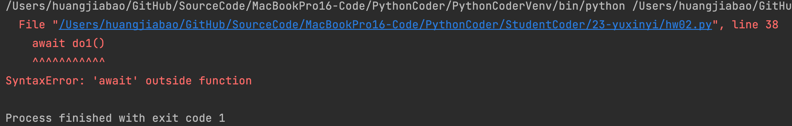
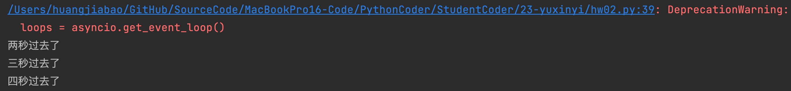

你好，我是悦创。

上一节课的最后，我们留下一个小小的悬念：生成器在 Python 2 中还扮演了一个重要角色，就是用来实现 Python 协程。

那么首先你要明白，什么是协程？

协程是实现并发编程的一种方式。一说并发，你肯定想到了多线程 / 多进程模型，没错，多线程 / 多进程，正是解决并发问题的经典模型之一。最初的互联网世界，多线程 / 多进程在服务器并发中，起到举足轻重的作用。

随着互联网的快速发展，你逐渐遇到了 C10K 瓶颈，也就是同时连接到服务器的客户达到了一万个。于是很多代码跑崩了，进程上下文切换占用了大量的资源，线程也顶不住如此巨大的压力，这时， NGINX 带着事件循环出来拯救世界了。

如果将多进程 / 多线程类比为起源于唐朝的藩镇割据，那么事件循环，就是宋朝加强的中央集权制。事件循环启动一个统一的调度器，让调度器来决定一个时刻去运行哪个任务，于是省却了多线程中启动线程、管理线程、同步锁等各种开销。同一时期的 NGINX，在高并发下能保持低资源低消耗高性能，相比 Apache 也支持更多的并发连接。

再到后来，出现了一个很有名的名词，叫做回调地狱（callback hell），手撸过 JavaScript 的朋友肯定知道我在说什么。我们大家惊喜地发现，这种工具完美地继承了事件循环的优越性，同时还能提供 async / await 语法糖，解决了执行性和可读性共存的难题。于是，协程逐渐被更多人发现并看好，也有越来越多的人尝试用 Node.js 做起了后端开发。（讲个笑话，JavaScript 是一门编程语言。）

回到我们的 Python。使用生成器，是 Python 2 开头的时代实现协程的老方法了，Python 3.7 提供了新的基于 asyncio 和 async / await 的方法。我们这节课，同样的，跟随时代，抛弃掉不容易理解、也不容易写的旧的基于生成器的方法，直接来讲新方法。

我们先从一个爬虫实例出发，用清晰的讲解思路，带你结合实战来搞懂这个不算特别容易理解的概念。之后，我们再由浅入深，直击协程的核心。

## 1. 从一个爬虫说起

爬虫，就是互联网的蜘蛛，在搜索引擎诞生之时，与其一同来到世上。爬虫每秒钟都会爬取大量的网页，提取关键信息后存储在数据库中，以便日后分析。爬虫有非常简单的 Python 十行代码实现，也有 Google 那样的全球分布式爬虫的上百万行代码，分布在内部上万台服务器上，对全世界的信息进行嗅探。

话不多说，我们先看一个简单的爬虫例子：

```python
import time

def crawl_page(url):
    print('crawling {}'.format(url))
    sleep_time = int(url.split('_')[-1])
    time.sleep(sleep_time)
    print('OK {}'.format(url))

def main(urls):
    for url in urls:
        crawl_page(url)

%time main(['url_1', 'url_2', 'url_3', 'url_4'])

########## 输出 ##########

crawling url_1
OK url_1
crawling url_2
OK url_2
crawling url_3
OK url_3
crawling url_4
OK url_4
Wall time: 10 s
```

（注意：本节的主要目的是协程的基础概念，因此我们简化爬虫的 scrawl_page 函数为休眠数秒，休眠时间取决于 url 最后的那个数字。）

这是一个很简单的爬虫，`main()` 函数执行时，调取 `crawl_page()` 函数进行网络通信，经过若干秒等待后收到结果，然后执行下一个。

看起来很简单，但你仔细一算，它也占用了不少时间，五个页面分别用了 1 秒到 4 秒的时间，加起来一共用了 10 秒。这显然效率低下，该怎么优化呢？

于是，一个很简单的思路出现了——我们这种爬取操作，完全可以并发化。我们就来看看使用协程怎么写。

```python
import asyncio

async def crawl_page(url):
    print('crawling {}'.format(url))
    sleep_time = int(url.split('_')[-1])
    await asyncio.sleep(sleep_time)
    print('OK {}'.format(url))

async def main(urls):
    for url in urls:
        await crawl_page(url)

%time asyncio.run(main(['url_1', 'url_2', 'url_3', 'url_4']))

########## 输出 ##########

crawling url_1
OK url_1
crawling url_2
OK url_2
crawling url_3
OK url_3
crawling url_4
OK url_4
Wall time: 10 s
```

看到这段代码，你应该发现了，在 Python 3.7 以上版本中，使用协程写异步程序非常简单。

首先来看 import asyncio，这个库包含了大部分我们实现协程所需的魔法工具。

async 修饰词声明异步函数，于是，这里的 crawl_page 和 main 都变成了异步函数。而调用异步函数，我们便可得到一个协程对象（coroutine object）。

举个例子，如果你 `print(crawl_page(''))`，便会输出，提示你这是一个 Python 的协程对象，而并不会真正执行这个函数。

再来说说协程的执行。执行协程有多种方法，这里我介绍一下常用的三种。

首先，我们可以通过 await 来调用。await 执行的效果，和 Python 正常执行是一样的，也就是说程序会阻塞在这里，进入被调用的协程函数，执行完毕返回后再继续，而这也是 await 的字面意思。代码中 `await asyncio.sleep(sleep_time)` 会在这里休息若干秒，`await crawl_page(url) `则会执行 `crawl_page()` 函数。

其次，我们可以通过 `asyncio.create_task()` 来创建任务，这个我们下节课会详细讲一下，你先简单知道即可。

最后，我们需要 `asyncio.run` 来触发运行。`asyncio.run` 这个函数是 Python 3.7 之后才有的特性，可以让 Python 的协程接口变得非常简单，你不用去理会事件循环怎么定义和怎么使用的问题（我们会在下面讲）。一个非常好的编程规范是，`asyncio.run(main())` 作为主程序的入口函数，在程序运行周期内，只调用一次 `asyncio.run`。

这样，你就大概看懂了协程是怎么用的吧。不妨试着跑一下代码，欸，怎么还是 10 秒？

10 秒就对了，还记得上面所说的，await 是同步调用，因此， `crawl_page(url)` 在当前的调用结束之前，是不会触发下一次调用的。于是，这个代码效果就和上面完全一样了，相当于我们用异步接口写了个同步代码。

现在又该怎么办呢？

其实很简单，也正是我接下来要讲的协程中的一个重要概念，任务（Task）。老规矩，先看代码。

::: code-tabs#python

@tab old

```python
import asyncio

async def crawl_page(url):
    print('crawling {}'.format(url))
    sleep_time = int(url.split('_')[-1])
    await asyncio.sleep(sleep_time)
    print('OK {}'.format(url))

async def main(urls):
    tasks = [asyncio.create_task(crawl_page(url)) for url in urls]
    for task in tasks:
        await task

%time asyncio.run(main(['url_1', 'url_2', 'url_3', 'url_4']))

########## 输出 ##########

crawling url_1
crawling url_2
crawling url_3
crawling url_4
OK url_1
OK url_2
OK url_3
OK url_4
Wall time: 3.99 s
```

@tab Run in Jupyter Notebook

```python {20-22}
import time
import asyncio


async def crawl_page(url):
    print("crawling {}".format(url))
    sleep_time = int(url.split("_")[-1])
    # time.sleep(sleep_time)
    await asyncio.sleep(sleep_time)
    print("OK {}".format(url))


async def main(urls):
    tasks = [asyncio.create_task(crawl_page(url)) for url in urls]
    for task in tasks:
        await task
    # for url in urls:
    #     await crawl_page(url)
# %time asyncio.run(main(['url_1', 'url_2', 'url_3', 'url_4']))
start_time = time.time()
await main(['url_1', 'url_2', 'url_3', 'url_4'])
print(time.time() - start_time)

########## 输出 ##########
crawling url_1
crawling url_2
crawling url_3
crawling url_4
OK url_1
OK url_2
OK url_3
OK url_4
4.005578994750977
```

@tab Python file

```python {20-22}
import time
import asyncio


async def crawl_page(url):
    print("crawling {}".format(url))
    sleep_time = int(url.split("_")[-1])
    # time.sleep(sleep_time)
    await asyncio.sleep(sleep_time)
    print("OK {}".format(url))


async def main(urls):
    tasks = [asyncio.create_task(crawl_page(url)) for url in urls]
    for task in tasks:
        await task
    # for url in urls:
    #     await crawl_page(url)
# %time asyncio.run(main(['url_1', 'url_2', 'url_3', 'url_4']))
start_time = time.time()
asyncio.run(main(['url_1', 'url_2', 'url_3', 'url_4']))
print(time.time() - start_time)
```

:::

你可以看到，我们有了协程对象后，便可以通过 `asyncio.create_task` 来创建任务。任务创建后很快就会被调度执行，这样，我们的代码也不会阻塞在任务这里。所以，我们要等所有任务都结束才行，用 `for task in tasks: await task` 即可。

这次，你就看到效果了吧，**结果显示，运行总时长等于运行时间最长的爬虫。**

::: info 探究协程原因

**举个例子🌰：**

目标：小 Cava 要做一道美味的鱼汤。

**正常的流程：**

1. 🐟杀鱼「3min」
2. 🫀清洗内脏「2min」
3. 🍳锅热入凉油「2min」
4. :flags:加入备好的：生姜、大葱「3min」
5. :high_brightness:煎至：两面金黄「5min」
6. :jack_o_lantern:加入凉水煮，等到煮开「15min」
7. 开吃～
8. PS：煮开水：15min
9. ⌚️Total Time：30 min

> 忽略细节部分，主要理解协程真谛。

**更好的流程：**

1. :jack_o_lantern:煮开水：15min
    1. 🐟杀鱼「3min」
    2. 🫀清洗内脏「2min」
    3. 🍳锅热入凉油「2min」
    4. :flags:加入备好的：生姜、大葱「3min」
    5. :high_brightness:煎至：两面金黄「5min」
2. 🐟鱼加入煮开的开水，再煮 2min，直接出锅～「鱼不是程序，还是得煮出鱼汤的，而计算机就不用。」
3. 开吃～
4. ⌚️Total Time：17min「要是计算机的话，不需要添加煮鱼的 2min」

---

煮开水被第二种方法，类似：挂起。那挂起就没有在煮开水吗？——No，还是在继续煮开水，不会因为你挂起而停止煮开水。

那协程是什么意思？就是把耗时的、请求慢的、下载慢的，挂起继续后台下载，在下载的时候呢，去请求其他的链接🔗。

:::

当然，你也可以想一想，这里用多线程应该怎么写？而如果需要爬取的页面有上万个又该怎么办呢？再对比下协程的写法，谁更清晰自是一目了然。

其实，对于执行 tasks，还有另一种做法：

::: code-tabs#python

@tab old

```python
import asyncio

async def crawl_page(url):
    print('crawling {}'.format(url))
    sleep_time = int(url.split('_')[-1])
    await asyncio.sleep(sleep_time)
    print('OK {}'.format(url))

async def main(urls):
    tasks = [asyncio.create_task(crawl_page(url)) for url in urls]
    await asyncio.gather(*tasks)

%time asyncio.run(main(['url_1', 'url_2', 'url_3', 'url_4']))

########## 输出 ##########

crawling url_1
crawling url_2
crawling url_3
crawling url_4
OK url_1
OK url_2
OK url_3
OK url_4
Wall time: 4.01 s
```

@tab Pycharm

```python
import asyncio, time


async def crawl_page(url):
    print('crawling {}'.format(url))
    sleep_time = int(url.split('_')[-1])
    await asyncio.sleep(sleep_time)
    print('OK {}'.format(url))


async def main(urls):
    tasks = [asyncio.create_task(crawl_page(url)) for url in urls]
    await asyncio.gather(*tasks)

start_time = time.time()
asyncio.run(main(['url_1', 'url_2', 'url_3', 'url_4']))
print(time.time() - start_time)
```

:::

这里的代码也很好理解。唯一要注意的是，`*tasks` 解包列表，将列表变成了函数的参数；与之对应的是， `** dict` 将字典变成了函数的参数。

另外，`asyncio.create_task`，`asyncio.run` 这些函数都是 Python 3.7 以上的版本才提供的，自然，相比于旧接口它们也更容易理解和阅读。

## 2. 补充

### 2.1 asyncio.gather vs asyncio.wait

在上面的内容，我们知道有：`asyncio.gather` 与 `asyncio.wait`，他们都可以让多个协程并发执行。那为什么提供 2 个方法呢？它们有什么区别，适用场景是怎么样的呢？其实我之前也是有点困惑，直到我读了 asyncio 的源码。我们先看 2 个协程的例子:

```python
import asyncio


async def a():
    print('Suspending a')
    await asyncio.sleep(3)
    print('Resuming a')
    return 'A'


async def b():
    print('Suspending b')
    await asyncio.sleep(1)
    print('Resuming b')
    return 'B'
```

在 IPython 里面用 gather 执行一下：

::: tabs

@tab Ipython

```python
In [2]: return_value_a, return_value_b = await asyncio.gather(a(), b())
Suspending a
Suspending b
Resuming b
Resuming a

In [3]: return_value_a, return_value_b
Out[3]: ('A', 'B')
```

Ok，`asyncio.gather` 方法的名字说明了它的用途，gather 的意思是「搜集」，也就是能够收集协程的结果，而且要注意，它会按输入协程的顺序保存的对应协程的执行结果。

接着我们说 `asyncio.await` ，先执行一下：

```python
In [4]: done, pending = await asyncio.wait([a(), b()])
<ipython-input-4-c7c81c0fc688>:1: DeprecationWarning: The explicit passing of coroutine objects to asyncio.wait() is deprecated since Python 3.8, and scheduled for removal in Python 3.11.
  done, pending = await asyncio.wait([a(), b()])
Suspending a
Suspending b
Resuming b
Resuming a

In [5]: done
Out[5]: 
{<Task finished name='Task-526' coro=<a() done, defined at <ipython-input-1-ad0e9324f79a>:4> result='A'>,
 <Task finished name='Task-527' coro=<b() done, defined at <ipython-input-1-ad0e9324f79a>:11> result='B'>}

In [6]: pending
Out[6]: set()

In [7]: task = list(done)[0]

In [8]: task
Out[8]: <Task finished name='Task-527' coro=<b() done, defined at <ipython-input-1-ad0e9324f79a>:11> result='B'>

In [9]: task.result
Out[9]: <function Task.result()>

In [10]: task.result()
Out[10]: 'B'
```

`asyncio.wait` 的返回值有 2 项，第一项表示完成的任务列表 (done)，第二项表示等待 (Future) 完成的任务列表 (pending)，每个任务都是一个 Task 实例，由于这 2 个任务都已经完成，所以可以执行 `task.result()` 获得协程返回值。

Ok, 说到这里，我总结下它俩的区别的第一层区别：

1. `asyncio.gather` 封装的 Task 全程黑盒，只告诉你协程结果。
2. `asyncio.wait` 会返回封装的 Task (包含已完成和挂起的任务)，如果你关注协程执行结果你需要从对应 Task 实例里面用 result 方法自己拿。

为什么说「第一层区别」，`asyncio.wait` 看名字可以理解为「等待」，所以返回值的第二项是 pending 集合，但是看上面的例子，pending 是空集合，那么在什么情况下，pending 里面不为空呢？这就是第二层区别：`asyncio.wait` 支持选择返回的时机。

`asyncio.wait` 支持一个接收参数 `return_when`，在默认情况下，`asyncio.wait` 会等待全部任务完成 `(return_when='ALL_COMPLETED')`，它还支持 `FIRST_COMPLETED`（第一个协程完成就返回）和 `FIRST_EXCEPTION`（出现第一个异常就返回）：

```python
In [11]: done, pending = await asyncio.wait([a(), b()], return_when=asyncio.tasks.FIRST_COMPLETED)
<ipython-input-11-36382977e01c>:1: DeprecationWarning: The explicit passing of coroutine objects to asyncio.wait() is deprecated since Python 3.8, and scheduled for removal in Python 3.11.
  done, pending = await asyncio.wait([a(), b()], return_when=asyncio.tasks.FIRST_COMPLETED)
Suspending a
Suspending b
Resuming b

In [12]: done
Out[12]: {<Task finished name='Task-1094' coro=<b() done, defined at <ipython-input-1-ad0e9324f79a>:11> result='B'>}

In [13]: pending
Out[13]: {<Task pending name='Task-1093' coro=<a() running at <ipython-input-1-ad0e9324f79a>:6> wait_for=<Future pending cb=[Task.task_wakeup()]>>}

In [14]: type(done), type(pending)
Out[14]: (set, set)
```

看到了吧，这次只有协程 b 完成了，协程 a 还是 pending 状态。

在大部分情况下，用 `asyncio.gather` 是足够的，如果你有特殊需求，可以选择 `asyncio.wait`，举 2 个例子：

1. 需要拿到封装好的 Task，以便取消或者添加成功回调等
2. 业务上需要 `FIRST_COMPLETED/FIRST_EXCEPTION` 即返回的

@tab Pycharm

```python
import asyncio


async def a():
    print('Suspending a')
    await asyncio.sleep(3)
    print('Resuming a')
    return 'A'


async def b():
    print('Suspending b')
    await asyncio.sleep(1)
    print('Resuming b')
    return 'B'


renwu = [a(), b()]
loops = asyncio.get_event_loop()
return_value_a, return_value_b = loops.run_until_complete(asyncio.wait(renwu))
# return_value_a, return_value_b = loops.run_until_complete(asyncio.gather(*renwu))
# return_value_a, return_value_b = loops.run_until_complete(asyncio.gather(a(), b()))
print(return_value_a, return_value_b)
```

@tab coro1.py

```python
import asyncio

async def a():
    print('Suspending a')
    await asyncio.sleep(3)
    print('Resuming a')
    return 'A'


async def b():
    print('Suspending b')
    await asyncio.sleep(1)
    print('Resuming b')
    return 'B'


async def c1():
    print(await asyncio.gather(a(), b()))


async def c2():
    print(await asyncio.wait([a(), b()]))


async def c3():
    print(await asyncio.wait(
        [a(), b()],
        return_when=asyncio.tasks.FIRST_COMPLETED))


if __name__ == '__main__':
    for f in (c1, c2, c3):
        asyncio.run(f())
```

:::

### 2.2 asyncio.create_task vs loop.create_task vs asyncio.ensure_future

创建一个 Task 一共有 3 种方法，如这小节的标题。从 Python 3.7 开始可以统一的使用更高阶的 `asyncio.create_task` 。其实`asyncio.create_task` 就是用的 `loop.create_task` ：

```python
from asyncio import events


def create_task(coro):
    loop = events.get_running_loop()
    return loop.create_task(coro)
```

`loop.create_task` 接受的参数需要是一个协程，但是 `asyncio.ensure_future` 除了接受协程，还可以是 Future 对象或者 awaitable 对象:

1. 如果参数是协程，其实底层还是用的 `loop.create_task`，返回 Task 对象
2. 如果是 Future 对象会直接返回
3. 如果是一个 awaitable 对象会 await 这个对象的 `__await__` 方法，再执行一次 `ensure_future`，最后返回 Task 或者 Future

所以就像 `ensure_future` 名字说的，确保这个是一个 Future 对象：Task 是 Future 子类，前面说过一般情况下开发者不需要自己创建 Future

其实前面说的 `asyncio.wait` 和 `asyncio.gather` 里面都用了 `asyncio.ensure_future` 。对于绝大多数场景要并发执行的是协程，所以直接用 `asyncio.create_task` 就足够了~

### 2.3 shield

接着说 `asyncio.shield`，用它可以屏蔽取消操作。一直到这里，我们还没有见识过 Task 的取消。看一个例子:

```python
In : loop = asyncio.get_event_loop()

In : task1 = loop.create_task(a())

In : task2 = loop.create_task(b())

In : task1.cancel()
Out: True

In : await asyncio.gather(task1, task2)
Suspending a
Suspending b
---------------------------------------------------------------------------
CancelledError                            Traceback (most recent call last)
cell_name in async-def-wrapper()

CancelledError:
```

在上面的例子中，task1 被取消了后再用 `asyncio.gather` 收集结果，直接抛 CancelledError 错误了。这里有个细节，gather 支持 `return_exceptions` 参数：

```python
In : await asyncio.gather(task1, task2, return_exceptions=True)
Out: [concurrent.futures._base.CancelledError(), 'B']
```

可以看到，task2 依然会执行完成，但是 task1 的返回值是一个 CancelledError 错误，也就是任务被取消了。如果一个创建后就不希望被任何情况取消，可以使用 `asyncio.shield` 保护任务能顺利完成：

```python
In : task1 = asyncio.shield(a())

In : task2 = loop.create_task(b())

In : ts = asyncio.gather(task1, task2, return_exceptions=True)

In : task1.cancel()
Out: True

In : await ts
Suspending a
Suspending b
Resuming a
Resuming b
Out: [concurrent.futures._base.CancelledError(), 'B']
```

可以看到虽然结果是一个 CancelledError 错误，但是看输出能确认协程实际上是执行了的。

::: info 注

此处之前有一个理解错误，已经在 [深入 asyncio.shield](#) 中重新解释和理解，推荐阅读。

:::

### 2.4 asynccontextmanager

如果你了解 Python，之前可能听过或者用过 contextmanager ，一个上下文管理器。通过一个计时的例子就理解它的作用:

```python
from contextlib import contextmanager


async def a():
    await asyncio.sleep(3)
    return 'A'


async def b():
    await asyncio.sleep(1)
    return 'B'


async def s1():
    return await asyncio.gather(a(), b())


@contextmanager
def timed(func):
    start = time.perf_counter()
    yield asyncio.run(func())
    print(f'Cost: {time.perf_counter() - start}')
```

timed 函数用了 contextmanager 装饰器，把协程的运行结果 yield 出来，执行结束后还计算了耗时：

```python
In : from contextmanager import *

In : with timed(s1) as rv:
...:     print(f'Result: {rv}')
...:
Result: ['A', 'B']
Cost: 3.0052654459999992
```

大家先体会一下。在 Python 3.7 添加了 asynccontextmanager，也就是异步版本的 contextmanager，适合异步函数的执行，上例可以这么改：

```python
@asynccontextmanager
async def async_timed(func):
    start = time.perf_counter()
    yield await func()
    print(f'Cost: {time.perf_counter() - start}')


async def main():
    async with async_timed(s1) as rv:
        print(f'Result: {rv}')

In : asyncio.run(main())
Result: ['A', 'B']
Cost: 3.00414147500004
```

async 版本的 with 要用 `async with`，另外要注意 `yield await func()` 这句，相当于 yield +`await func()`

PS: contextmanager 和 asynccontextmanager 最好的理解方法是去看源码注释，可以看延伸阅读链接 2，另外延伸阅读链接 3 包含的 PR 中相关的测试代码部分也能帮助你理解。

### 2.5 延伸阅读

1. [https://github.com/python/cpython/blob/3.7/Lib/asyncio/tasks.py#L574](https://github.com/python/cpython/blob/3.7/Lib/asyncio/tasks.py#L574)
2. [https://github.com/python/cpython/blob/3.7/Lib/contextlib.py#L243](https://github.com/python/cpython/blob/3.7/Lib/contextlib.py#L243)
3. [https://github.com/python/cpython/pull/360/](https://github.com/python/cpython/pull/360/)


## 3. 解密协程运行时

说了这么多，现在，我们不妨来深入代码底层看看。有了前面的知识做基础，你应该很容易理解这两段代码。

```python
import asyncio

async def worker_1():
    print('worker_1 start')
    await asyncio.sleep(1)
    print('worker_1 done')

async def worker_2():
    print('worker_2 start')
    await asyncio.sleep(2)
    print('worker_2 done')

async def main():
    print('before await')
    await worker_1()
    print('awaited worker_1')
    await worker_2()
    print('awaited worker_2')

%time asyncio.run(main())

########## 输出 ##########

before await
worker_1 start
worker_1 done
awaited worker_1
worker_2 start
worker_2 done
awaited worker_2
Wall time: 3 s
```

```python
import asyncio

async def worker_1():
    print('worker_1 start')
    await asyncio.sleep(1)
    print('worker_1 done')

async def worker_2():
    print('worker_2 start')
    await asyncio.sleep(2)
    print('worker_2 done')

async def main():
    task1 = asyncio.create_task(worker_1())
    task2 = asyncio.create_task(worker_2())
    print('before await')
    await task1
    print('awaited worker_1')
    await task2
    print('awaited worker_2')

%time asyncio.run(main())

########## 输出 ##########

before await
worker_1 start
worker_2 start
worker_1 done
awaited worker_1
worker_2 done
awaited worker_2
Wall time: 2.01 s
```

不过，第二个代码，到底发生了什么呢？为了让你更详细了解到协程和线程的具体区别，这里我详细地分析了整个过程。步骤有点多，别着急，我们慢慢来看。

1. `asyncio.run(main())`，程序进入 `main()` 函数，事件循环开启；
2. task1 和 task2 任务被创建，并进入事件循环等待运行；运行到 print，输出 `'before await'`；
3. await task1 执行，用户选择从当前的主任务中切出，事件调度器开始调度 `worker_1`；
4. `worker_1` 开始运行，运行 print 输出 `'worker_1 start'`，然后运行到 `await asyncio.sleep(1)`， 从当前任务切出，事件调度器开始调度 `worker_2`；
5. `worker_2` 开始运行，运行 print 输出 `'worker_2 start'`，然后运行 `await asyncio.sleep(2)` 从当前任务切出；
6. 以上所有事件的运行时间，都应该在 1ms 到 10ms 之间，甚至可能更短，事件调度器从这个时候开始暂停调度；
7. 一秒钟后，`worker_1` 的 sleep 完成，事件调度器将控制权重新传给 `task_1`，输出 `'worker_1 done'`，`task_1` 完成任务，从事件循环中退出；
8. `await task1` 完成，事件调度器将控制器传给主任务，输出 `'awaited worker_1'`，·然后在 `await task2` 处继续等待；
9. 两秒钟后，`worker_2` 的 sleep 完成，事件调度器将控制权重新传给 `task_2`，输出 `'worker_2 done'`，`task_2` 完成任务，从事件循环中退出；
10. 主任务输出 `'awaited worker_2'`，协程全任务结束，事件循环结束。

接下来，我们进阶一下。如果我们想给某些协程任务限定运行时间，一旦超时就取消，又该怎么做呢？再进一步，如果某些协程运行时出现错误，又该怎么处理呢？同样的，来看代码。

```python
import asyncio

async def worker_1():
    await asyncio.sleep(1)
    return 1

async def worker_2():
    await asyncio.sleep(2)
    return 2 / 0

async def worker_3():
    await asyncio.sleep(3)
    return 3

async def main():
    task_1 = asyncio.create_task(worker_1())
    task_2 = asyncio.create_task(worker_2())
    task_3 = asyncio.create_task(worker_3())

    await asyncio.sleep(2)
    task_3.cancel()

    res = await asyncio.gather(task_1, task_2, task_3, return_exceptions=True)
    print(res)

%time asyncio.run(main())

########## 输出 ##########

[1, ZeroDivisionError('division by zero'), CancelledError()]
Wall time: 2 s
```

你可以看到，`worker_1` 正常运行，`worker_2` 运行中出现错误，`worker_3` 执行时间过长被我们 cancel 掉了，这些信息会全部体现在最终的返回结果 res 中。

不过要注意 `return_exceptions=True` 这行代码。如果不设置这个参数，错误就会完整地 throw 到我们这个执行层，从而需要 `try except` 来捕捉，这也就意味着其他还没被执行的任务会被全部取消掉。为了避免这个局面，我们将 `return_exceptions` 设置为 True 即可。

到这里，发现了没，线程能实现的，协程都能做到。那就让我们温习一下这些知识点，用协程来实现一个经典的生产者消费者模型吧。

```python
import asyncio
import random

async def consumer(queue, id):
    while True:
        val = await queue.get()
        print('{} get a val: {}'.format(id, val))
        await asyncio.sleep(1)

async def producer(queue, id):
    for i in range(5):
        val = random.randint(1, 10)
        await queue.put(val)
        print('{} put a val: {}'.format(id, val))
        await asyncio.sleep(1)

async def main():
    queue = asyncio.Queue()

    consumer_1 = asyncio.create_task(consumer(queue, 'consumer_1'))
    consumer_2 = asyncio.create_task(consumer(queue, 'consumer_2'))

    producer_1 = asyncio.create_task(producer(queue, 'producer_1'))
    producer_2 = asyncio.create_task(producer(queue, 'producer_2'))

    await asyncio.sleep(10)
    consumer_1.cancel()
    consumer_2.cancel()
    
    await asyncio.gather(consumer_1, consumer_2, producer_1, producer_2, return_exceptions=True)

%time asyncio.run(main())

########## 输出 ##########

producer_1 put a val: 5
producer_2 put a val: 3
consumer_1 get a val: 5
consumer_2 get a val: 3
producer_1 put a val: 1
producer_2 put a val: 3
consumer_2 get a val: 1
consumer_1 get a val: 3
producer_1 put a val: 6
producer_2 put a val: 10
consumer_1 get a val: 6
consumer_2 get a val: 10
producer_1 put a val: 4
producer_2 put a val: 5
consumer_2 get a val: 4
consumer_1 get a val: 5
producer_1 put a val: 2
producer_2 put a val: 8
consumer_1 get a val: 2
consumer_2 get a val: 8
Wall time: 10 s
```

## 4. 实战：豆瓣近日推荐电影爬虫

最后，进入今天的实战环节——实现一个完整的协程爬虫。

任务描述：[https://movie.douban.com/cinema/later/beijing/](https://movie.douban.com/cinema/later/beijing/) 这个页面描述了北京最近上映的电影，你能否通过 Python 得到这些电影的名称、上映时间和海报呢？这个页面的海报是缩小版的，我希望你能从具体的电影描述页面中抓取到海报。

听起来难度不是很大吧？我在下面给出了同步版本的代码和协程版本的代码，通过运行时间和代码写法的对比，希望你能对协程有更深的了解。（注意：为了突出重点、简化代码，这里我省略了异常处理。）

不过，在参考我给出的代码之前，你是不是可以自己先动手写一下、跑一下呢？

:::: tabs

@tab 正常版本

```python
import requests
from bs4 import BeautifulSoup


def main():
    headers = {
        "User-Agent": "Mozilla/5.0 (Macintosh; Intel Mac OS X 10_15_7) AppleWebKit/537.36 (KHTML, like Gecko) Chrome/109.0.0.0 Safari/537.36",
    }
    url = "https://movie.douban.com/cinema/later/beijing/"
    init_page = requests.get(url, headers=headers).content
    # print(init_page)
    init_soup = BeautifulSoup(init_page, 'lxml')
    # print(init_soup)
    all_movies = init_soup.find('div', id="showing-soon")
    # print(all_movies)
    for each_movie in all_movies.find_all('div', class_="item"):
        # print(each_movie)
        all_a_tag = each_movie.find_all('a')
        # print(all_a_tag)
        all_li_tag = each_movie.find_all('li')
        # print(all_li_tag)
        movie_name = all_a_tag[1].text
        # print(movie_name)
        url_to_fetch = all_a_tag[1]['href']
        # print(url_to_fetch)
        movie_date = all_li_tag[0].text
        # print(movie_date)
        response_item = requests.get(url_to_fetch, headers=headers).content
        # print(response_item)
        soup_item = BeautifulSoup(response_item, 'lxml')
        img_tag = soup_item.find('img')
        # print(img_tag)
        print('{} {} {}'.format(movie_name, movie_date, img_tag['src']))


%time main()
```

::: details 输出

```python
风再起时 02月05日 https://img9.doubanio.com/view/photo/s_ratio_poster/public/p2887039584.jpg
黑豹2 02月07日 https://img9.doubanio.com/view/photo/s_ratio_poster/public/p2886589774.jpg
不能流泪的悲伤 02月14日 https://img1.doubanio.com/view/photo/s_ratio_poster/public/p2886531289.jpg
蚁人与黄蜂女：量子狂潮 02月17日 https://img1.doubanio.com/view/photo/s_ratio_poster/public/p2886589789.jpg
中国乒乓之绝地反击 02月17日 https://img9.doubanio.com/view/photo/s_ratio_poster/public/p2887100255.jpg
印式英语 02月24日 https://img1.doubanio.com/view/photo/s_ratio_poster/public/p2886633470.jpg
毒舌律师 02月24日 https://img9.doubanio.com/view/photo/s_ratio_poster/public/p2886619074.jpg
会考试的猛犸象 02月24日 https://img9.doubanio.com/view/photo/s_ratio_poster/public/p2879572685.jpg
拨浪鼓咚咚响 02月25日 https://img2.doubanio.com/view/photo/s_ratio_poster/public/p2886538033.jpg
宇宙探索编辑部 04月01日 https://img1.doubanio.com/view/photo/s_ratio_poster/public/p2886529968.jpg
龙马精神 04月07日 https://img2.doubanio.com/view/photo/s_ratio_poster/public/p2887204283.jpg
长空之王 04月28日 https://img9.doubanio.com/view/photo/s_ratio_poster/public/p2886235064.jpg
人生路不熟 04月28日 https://img1.doubanio.com/view/photo/s_ratio_poster/public/p2887091779.jpg
检察风云 04月29日 https://img1.doubanio.com/view/photo/s_ratio_poster/public/p2886533208.jpg
请别相信她 05月20日 https://img1.doubanio.com/view/photo/s_ratio_poster/public/p2886540928.jpg
伟大的胜利 09月30日 https://img1.doubanio.com/view/photo/s_ratio_poster/public/p2886621940.jpg
CPU times: user 564 ms, sys: 29.9 ms, total: 594 ms
Wall time: 19.7 s
```

:::

@tab 协程版本

```python
import asyncio
import aiohttp

from bs4 import BeautifulSoup

header = {
    "User-Agent": "Mozilla/5.0 (Macintosh; Intel Mac OS X 10_15_7) AppleWebKit/537.36 (KHTML, like Gecko) Chrome/109.0.0.0 Safari/537.36",
}

async def fetch_content(url):
    async with aiohttp.ClientSession(
        headers=header, connector=aiohttp.TCPConnector(ssl=False)
    ) as session:
        async with session.get(url) as response:
            return await response.text()

async def main():
    url = "https://movie.douban.com/cinema/later/beijing/"
    init_page = await fetch_content(url)
    init_soup = BeautifulSoup(init_page, 'lxml')

    movie_names, urls_to_fetch, movie_dates = [], [], []

    all_movies = init_soup.find('div', id="showing-soon")
    for each_movie in all_movies.find_all('div', class_="item"):
        all_a_tag = each_movie.find_all('a')
        all_li_tag = each_movie.find_all('li')

        movie_names.append(all_a_tag[1].text)
        urls_to_fetch.append(all_a_tag[1]['href'])
        movie_dates.append(all_li_tag[0].text)

    tasks = [fetch_content(url) for url in urls_to_fetch]
    pages = await asyncio.gather(*tasks)

    for movie_name, movie_date, page in zip(movie_names, movie_dates, pages):
        soup_item = BeautifulSoup(page, 'lxml')
        img_tag = soup_item.find('img')

        print('{} {} {}'.format(movie_name, movie_date, img_tag['src']))

# %time asyncio.run(main())

if __name__ == '__main__':
    start_time = time.time()
    loops = asyncio.get_event_loop()
    loops.run_until_complete(main())
    print(time.time() - start_time)

########## 输出 ##########

阿拉丁 05月24日 https://img3.doubanio.com/view/photo/s_ratio_poster/public/p2553992741.jpg
龙珠超：布罗利 05月24日 https://img3.doubanio.com/view/photo/s_ratio_poster/public/p2557371503.jpg
五月天人生无限公司 05月24日 https://img3.doubanio.com/view/photo/s_ratio_poster/public/p2554324453.jpg
... ...
直播攻略 06月04日 https://img3.doubanio.com/view/photo/s_ratio_poster/public/p2555957974.jpg
Wall time: 4.98 s
```

::::

## 5. 总结

到这里，今天的主要内容就讲完了。今天我用了较长的篇幅，从一个简单的爬虫开始，到一个真正的爬虫结束，在中间穿插讲解了 Python 协程最新的基本概念和用法。这里带你简单复习一下。

- 协程和多线程的区别，主要在于两点，一是协程为单线程；二是协程由用户决定，在哪些地方交出控制权，切换到下一个任务。
- 协程的写法更加简洁清晰，把 async / await 语法和 `create_task` 结合来用，对于中小级别的并发需求已经毫无压力。
- 写协程程序的时候，你的脑海中要有清晰的事件循环概念，知道程序在什么时候需要暂停、等待 I/O，什么时候需要一并执行到底。

最后的最后，请一定不要轻易炫技。多线程模型也一定有其优点，一个真正牛逼的程序员，应该懂得，在什么时候用什么模型能达到工程上的最优，而不是自觉某个技术非常牛逼，所有项目创造条件也要上。技术是工程，而工程则是时间、资源、人力等纷繁复杂的事情的折衷。

## 6. 思考题

最后给你留一个思考题。协程怎么实现回调函数呢？欢迎留言和我讨论，也欢迎你把这篇文章分享给你的同事朋友，我们一起交流，一起进步。

## 7. 评论

### 7.1 讲师

发现评论区好多朋友说无法运行，在这里统一解释下： 

1. `%time` 是 jupyter notebook 自带的语法糖，用来统计一行命令的运行时间；如果你的运行时是纯粹的命令行 python，或者 pycharm，那么请把 `%time` 删掉，自己用传统的时间戳方法来记录时间也可以；或者使用 jupyter notebook 
2. 我的本地解释器是 Anaconda Python 3.7.3，亲测 windows / ubuntu 均可正常运行，如无法执行可以试试 `pip install nest-asyncio`，依然无法解决请尝试安装 Anaconda Python 
3. 这次代码因为使用了较新的 API，所以需要较新的版本号，但是朋友们依然出现了一些运行时问题，这里先表示下歉意；同时也想说明的是，在提问之前自己经过充分搜索，尝试后解决问题，带来的快感，和能力的提升，相应也是很大的，一门工程最需要的是 hands on dirty work（动手做脏活），才能让自己的能力得到本质的提升，加油！

---

### 7.2 讲师

**思考题答案：** 

在 Python 3.7 及以上的版本中，我们对 task 对象调用 `add_done_callback() `函数，即可绑定特定回调函数。回调函数接受一个 future 对象，可以通过 `future.result()` 来获取协程函数的返回值。

**示例如下：**

::: code-tabs#python

@tab old

```python
import asyncio

async def crawl_page(url):
    print('crawling {}'.format(url))
    sleep_time = int(url.split('_')[-1])
    await asyncio.sleep(sleep_time)
    return 'OK {}'.format(url)

async def main(urls):
    tasks = [asyncio.create_task(crawl_page(url)) for url in urls]
    for task in tasks:
        task.add_done_callback(lambda future: print('result: ', future.result()))
    await asyncio.gather(*tasks)

%time asyncio.run(main(['url_1', 'url_2', 'url_3', 'url_4']))

# 输出：

crawling url_1
crawling url_2
crawling url_3
crawling url_4
result:  OK url_1
result:  OK url_2
result:  OK url_3
result:  OK url_4
Wall time: 4 s
```

@tab Run on Jupyter Notebook

```python {15-17}
import asyncio, time

async def crawl_page(url):
    print('crawling {}'.format(url))
    sleep_time = int(url.split('_')[-1])
    await asyncio.sleep(sleep_time)
    return 'OK {}'.format(url)

async def main(urls):
    tasks = [asyncio.create_task(crawl_page(url)) for url in urls]
    for task in tasks:
        task.add_done_callback(lambda future: print('result: ', future.result()))
    await asyncio.gather(*tasks)

start_time = time.time()
await main(['url_1', 'url_2', 'url_3', 'url_4'])
print(time.time() - start_time)
```

@tab Run on Pycharm

```python {18-20}
import asyncio, time


async def crawl_page(url):
    print('crawling {}'.format(url))
    sleep_time = int(url.split('_')[-1])
    await asyncio.sleep(sleep_time)
    return 'OK {}'.format(url)


async def main(urls):
    tasks = [asyncio.create_task(crawl_page(url)) for url in urls]
    for task in tasks:
        task.add_done_callback(lambda future: print('result: ', future.result()))
    await asyncio.gather(*tasks)


start_time = time.time()
asyncio.run(main(['url_1', 'url_2', 'url_3', 'url_4']))
print(time.time() - start_time)
```

:::

---

### 7.3 helloworld

说一下我对 await 的理解： 开发者要提前知道一个任务的哪个环节会造成 I/O 阻塞，然后把这个环节的代码异步化处理，并且通过 await来标识在任务的该环节中断该任务执行，从而去执行下一个事件循环任务。这样可以充分利用 CPU 资源，避免 CPU 等待 I/O 造成 CPU 资源白白浪费。当之前任务的那个环节的 I/O 完成后，线程可以从 await 获取返回值，然后继续执行没有完成的剩余代码。 由上面分析可知，如果一个任务不涉及到网络或磁盘 I/O 这种耗时的操作，而只有 CPU 计算和内存 I/O 的操作时，协程并发的性能还不如单线程 loop 循环的性能高。

---

### 7.4 大侠110

感觉还是有很多人看不懂，我试着用通俗的语句讲一下：协成里面重要的是一个关键字 await 的理解，async 表示其修饰的是协程任务即 task，await 表示的是当线程执行到这一句，此时该 task 在此处挂起，然后调度器去执行其他的 task，当这个挂起的部分处理完，会调用回掉函数告诉调度器我已经执行完了，那么调度器就返回来处理这个 task 的余下语句。

---

### 7.5 Airnm.毁

豆瓣那个发现 `requests.get(url).content/text` 返回都为空，然后打了下 status_code 发现是 418，网上找 418 的解释，一般是网站反爬虫基础机制，需要加请求头模仿浏览器就可跳过，改为下面的样子就可通过：

```python
url = "https://movie.douban.com/cinema/later/beijing/" 
head={    'User-Agent':'Mozilla/5.0 (Windows NT 6.1; Win64; x64) AppleWebKit/537.36 (KHTML, like Gecko)Chrome/81.0.4044.113 Safari/537.36',
      'Referer':'https://time.geekbang.org/column/article/101855',
      'Connection':'keep-alive'} 
res = requests.get(url, headers=head)
```

> 作者回复: 👍，可能是增加了反爬虫机制

---

### 7.7 长期规划

老师，在最后那个协程例子中为何没用 requests 库呢？是因为它不支持协程吗

> 作者回复: 协程使用的是 aiohttp 并发网络 io 库，因此就不需要 requests 了

## 8. 报错处理

### 8.1 RuntimeError: asyncio.run() cannot be called from a running event loop

学习协程异步操作出现的问题：

```python
import asyncio
import time
async def func_4():
    print("营养快线")
    # time.sleep(3) 
    # print("娃哈哈")

if __name__=='__main__':
    g = func_4() # 此时的函数是异步协程函数，此时函数执行得到一个协程对象
    asyncio.run(g)
```

代码报错：

`RuntimeError: asyncio.run() cannot be called from a running event loop`

意思大致就是 jupyter 已经运行了 loop，无需自己激活，修改为：

```python
import asyncio
import time
async def func_4():
    print("营养快线")
    # time.sleep(3) 
    # print("娃哈哈")

if __name__=='__main__':
    g = func_4() # 此时的函数是异步协程函数，此时函数执行得到一个协程对象
    #asyncio.run(g)
    await g
```

### 8.2 SyntaxError: ‘await‘ outside async function的原因与解决

我们看下面这个代码，表面上没什么问题：

```python
import asyncio


async def do1():
    await asyncio.sleep(2)
    print('两秒过去了')


async def do2():
    await asyncio.sleep(2)
    print('两秒又过去了')


async def do3():
    await asyncio.sleep(4)
    print('四秒过去了')


await do1()
await do2()
await do3()
```

但运行了以后会这样报错：



**原因：** await 是要和创建协程时 async 一起搭配使用的，直接使用 await 就会找不到他所在的函数的，于是报错在函数外。

解决方法：

- 创建任务单
- 创建事件
- 实现并发运行

改进代码：

```python
import asyncio


async def do1():
    await asyncio.sleep(2)
    print('两秒过去了')


async def do2():
    await asyncio.sleep(3)
    print('三秒过去了')


async def do3():
    await asyncio.sleep(4)
    print('四秒过去了')


renwu = [do1(), do2(), do3()]
loops = asyncio.get_event_loop()
loops.run_until_complete(asyncio.wait(renwu))
```



完成的很顺利。

欢迎关注我公众号：AI悦创，有更多更好玩的等你发现！

::: details 公众号：AI悦创【二维码】


:::

::: info AI悦创·编程一对一

AI悦创·推出辅导班啦，包括「Python 语言辅导班、C++ 辅导班、java 辅导班、算法/数据结构辅导班、少儿编程、pygame 游戏开发」，全部都是一对一教学：一对一辅导 + 一对一答疑 + 布置作业 + 项目实践等。当然，还有线下线上摄影课程、Photoshop、Premiere 一对一教学、QQ、微信在线，随时响应！微信：Jiabcdefh

C++ 信息奥赛题解，长期更新！长期招收一对一中小学信息奥赛集训，莆田、厦门地区有机会线下上门，其他地区线上。微信：Jiabcdefh

方法一：[QQ](http://wpa.qq.com/msgrd?v=3&uin=1432803776&site=qq&menu=yes)

方法二：微信：Jiabcdefh

:::


