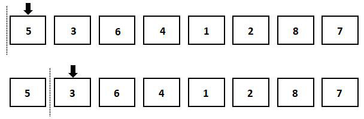
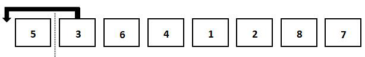
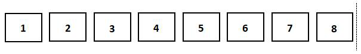

## 1. 排序简介

排序通常指把毫无规律的数据，按照一种特定的规律，整理成有序排列的状态。一般情况下，排序算法按照关键字的大小，以从小到大或从大到小的顺序将数据排列。

排序算法是最基础也最重要的算法之一，在处理大量数据时，使用一个优秀的排序算法可以节省大量时间和空间。因为不同的排序算法拥有不同的特点，所以我们根据情况选择合适的排序算法。

直观地讲，插入排序算法把给定数组中的元素依次插入到一个新的数组中，最终得到一个完整的有序数组。

## 2. 插入排序效率分析

在第一章中，我们已经讲过如何计算时间复杂度与空间复杂度，所以本章不再给出计算过程。插入排序的平均时间复杂度是 $O(n^2)$，最好情况下的时间复杂度是 $O(n)$, 最坏情况下的时间复杂度是 $O(n^2)$。它的空间复杂度是 $O(1)$。

插入排序还是一个稳定的排序算法。这里涉及到一个新的概念：排序算法的稳定性。 排序算法可以分为稳定的算法和不稳定的算法两类。在一个数组中，我们假设存在多个有相同关键字的元素。如果使用算法进行排序后，这些具有相同关键字的元素相对顺序一定保持不变，那么我们称这个排序算法为稳定的排序算法。冒泡排序、插入排序和归并排序等都是稳定的排序算法。而不能保证这些元素排序前后的相对位置相同的算法，就是不稳定的排序算法。选择排序，希尔排序和快速排序等都是不稳定的排序算法。


## 3. 插入排序原理

直接插入排序的实现过程较为直观。

排序开始时，我们对范例数组的每一个元素进行遍历。如图1所示，虚线的左侧表示已经有序的元素，右侧表示待排序的元素。

初始状态下，所有的元素都处于无序的状态，所以它们都在虚线的右侧。首先遍历的是第一个元素，这时候有序的数组为空（暂且把整个数组在虚线左侧的部分考虑成一个整体），所以第一个元素插入左侧的数组后必定是有序的。

第一个元素插入完成后，接下来遍历的是整个数组中的第二个元素。



此时，我们就要考虑：如何使得左侧有序的数组在新元素插入后保持有序？答案是再遍历一遍左侧有序的数组，找到正确的位置再插入新的元素。如下图所示，第二个元素3比有序数组中的5小，所以应该把它插入到5的左侧。



如下图所示，随后的过程是相似的。我们依次遍历无序数组中的元素，并把它们插入到有序数组中正确的位置。



当对无序数组的遍历完成后，有序数组中就包含了所有原始数组中的元素。这时候对原始数组的排序就完成了。

## 4. 插入排序代码

插入排序的代码再现了这个移动元素的过程。以下代码将数组 nums 正序排序。

插入排序代码：

::: code-tabs

@tab simple code

```python
nums = [5,3,6,4,1,2,8,7] 
for i in range(1, len(nums)): 		#遍历未排序的元素
   for j in range(i):           		#遍历已有序的元素
      if nums[j]>nums[i]: 			#找到插入位置 
         ins = nums[i]
         nums.pop(i)        
         nums.insert(j, ins)
         break 					#完成插入后跳出for循环
print(nums)
```

@tab 详细注释

```python
# 原数组
numbers = [5,3,6,4,1,2,8,7] 

# 外层循环，开始于数组的第二个元素，因为我们将第一个元素看作是已经排序的
for current_index in range(1, len(numbers)): 		
   
   # 内层循环，遍历已排序部分的元素
   for sorted_index in range(current_index):            
      
      # 如果在已排序部分找到一个比当前元素大的值，说明需要将当前元素插入到这个位置
      if numbers[sorted_index] > numbers[current_index]: 	
         
         # 取出当前需要排序的元素
         to_insert = numbers[current_index]
         
         # 从数组中移除当前元素
         numbers.pop(current_index)        
         
         # 将当前元素插入到正确的位置
         numbers.insert(sorted_index, to_insert)
         
         # 完成插入后跳出内层for循环，进入下一个元素的排序
         break 					

# 打印排序后的数组
print(numbers)
```

:::

运行程序，输出结果为：

```python
[1, 2, 3, 4, 5, 6, 7, 8]
```

代码中，第一个 for 循环用于遍历未排序元素。在上面的演示中，我们知道下标为 0 的元素，也就是第一个元素，已经处于有序状态，所以可以直接从第二个元素开始插入排序，使用 `range(1, len(nums))` 。

第二个 for 循环用于遍历已排序的元素，也就是下标小于当前元素的所有元素，所以使用 `range(i)`。判断插入位置时，由于我们想把元素递增地排列，所以当前元素的插入位置应当是在第一个大于它的数据之前。

因为找到比当前元素大的数据后，程序会立刻进行插入排序并跳出循环，从而可以确定已经遍历过的元素必定小于当前元素。如果所有有序的元素都小于当前元素，那么当前元素应当留在原来的位置上，不必再进行插入排序。


## 5. 小结

本节讲解了插入排序算法，插入排序算法是一种较为基础且容易理解的排序算法。在本章中，初级排序算法包含插入排序、选择排序和冒泡排序三种算法。虽然它们的效率相对于高级排序算法偏低，但是了解初级排序算法之后，再去学习相对复杂的高级排序算法会容易许多。

## 6. 练习

1. **题目1**: 编写一个 Python 函数，使用选择排序算法对列表进行排序。然后在一组随机生成的数上测试你的函数。

2. **题目2**: 编写一个 Python 程序，使用选择排序算法对字符串列表进行字典排序。

3. **题目3**: 在 Python 中，尝试修改标准的选择排序算法以逆序排序数组。

4. **题目4**: 编写一个 Python 程序，将选择排序算法应用于字典，根据字典的值进行排序。

5. **题目5**: 编写一个 Python 函数，用选择排序算法对元组数组进行排序。例如，给定元组数组 `[(2, 5), (1, 3), (4, 1), (2, 3)]`，应返回 `[(1, 3), (2, 3), (2, 5), (4, 1)]` 。

**题目1**: 编写一个Python函数，使用选择排序算法对列表进行排序。然后在一组随机生成的数上测试你的函数。

```python
import random

def selection_sort(arr):
    # 遍历所有数组元素
    for i in range(len(arr)):
        # 找到当前序列中最小元素的索引
        min_index = i
        for j in range(i+1, len(arr)):
            if arr[min_index] > arr[j]:
                min_index = j
            
        # 交换当前序列最小元素与当前元素
        arr[i], arr[min_index] = arr[min_index], arr[i]

    return arr

# 生成一个长度为10的随机整数列表，每个元素的值在1-100之间
random_list = random.sample(range(1, 100), 10)
print('Before sorting:', random_list)
sorted_list = selection_sort(random_list)
print('After sorting:', sorted_list)
```

**题目2**: 编写一个Python程序，使用选择排序算法对字符串列表进行字典排序。

```python
def selection_sort(arr):
    # 遍历所有数组元素
    for i in range(len(arr)):
        # 找到当前序列中最小元素的索引
        min_index = i
        for j in range(i+1, len(arr)):
            if arr[min_index] > arr[j]:
                min_index = j
            
        # 交换当前序列最小元素与当前元素
        arr[i], arr[min_index] = arr[min_index], arr[i]

    return arr

str_list = ['apple', 'banana', 'cherry', 'date', 'elderberry']
print('Before sorting:', str_list)
sorted_list = selection_sort(str_list)
print('After sorting:', sorted_list)
```

**题目3**: 在Python中，尝试修改标准的选择排序算法以逆序排序数组。

```python
def selection_sort_desc(arr):
    # 遍历所有数组元素
    for i in range(len(arr)):
        # 找到当前序列中最大元素的索引
        max_index = i
        for j in range(i+1, len(arr)):
            if arr[max_index] < arr[j]:
                max_index = j
            
        # 交换当前序列最大元素与当前元素
        arr[i], arr[max_index] = arr[max_index], arr[i]

    return arr

arr = [64, 25, 12, 22, 11]
print("Before sorting:", arr)
sorted_arr = selection_sort_desc(arr)
print("After sorting in descending order:", sorted_arr)
```

**题目4**: 编写一个Python程序，将选择排序算法应用于字典，根据字典的值进行排序。

```python
def selection_sort_dict(d):
    # 将字典转换为元组列表
    items = list(d.items())

    # 选择排序，但是此次比较的是元组的第二个元素
    for i in range(len(items)):
        min_index = i
        for j in range(i+1, len(items)):
            if items[min_index][1] > items[j][1]:
                min_index = j
        
        items[i], items[min_index

] = items[min_index], items[i]

    # 将排序后的元组列表再转换回字典
    sorted_dict = dict(items)
    return sorted_dict

d = {'a': 2, 'b': 1, 'c': 5, 'd': 4, 'e': 3}
print("Before sorting:", d)
sorted_dict = selection_sort_dict(d)
print("After sorting by value:", sorted_dict)
```

**题目5**: 编写一个Python函数，用选择排序算法对元组数组进行排序。

```python
def selection_sort_tuples(arr):
    # 遍历所有数组元素
    for i in range(len(arr)):
        # 找到当前序列中最小元素的索引
        min_index = i
        for j in range(i+1, len(arr)):
            if arr[min_index] > arr[j]:
                min_index = j
            
        # 交换当前序列最小元素与当前元素
        arr[i], arr[min_index] = arr[min_index], arr[i]

    return arr

tuples = [(2, 5), (1, 3), (4, 1), (2, 3)]
print('Before sorting:', tuples)
sorted_tuples = selection_sort_tuples(tuples)
print('After sorting:', sorted_tuples)
```

## 7. 杂谈

### 7.1 选择排序的思路是什么？

选择排序（Selection Sort）是一种简单直观的排序算法。其工作原理如下：

1. 在未排序序列中找到最小（或最大）的元素，存放到排序序列的起始位置。
2. 从剩余未排序元素中继续寻找最小（或最大）元素，然后放到已排序序列的末尾。
3. 以此类推，直到所有元素均排序完毕。

选择排序的主要优点是实现简单，对于小规模数据的排序，它是有效的。但由于其时间复杂度是 O(n²)，所以当数据规模较大时，效率并不高。


欢迎关注我公众号：AI悦创，有更多更好玩的等你发现！

::: details 公众号：AI悦创【二维码】


:::

::: info AI悦创·编程一对一

AI悦创·推出辅导班啦，包括「Python 语言辅导班、C++ 辅导班、java 辅导班、算法/数据结构辅导班、少儿编程、pygame 游戏开发」，全部都是一对一教学：一对一辅导 + 一对一答疑 + 布置作业 + 项目实践等。当然，还有线下线上摄影课程、Photoshop、Premiere 一对一教学、QQ、微信在线，随时响应！微信：Jiabcdefh

C++ 信息奥赛题解，长期更新！长期招收一对一中小学信息奥赛集训，莆田、厦门地区有机会线下上门，其他地区线上。微信：Jiabcdefh

方法一：[QQ](http://wpa.qq.com/msgrd?v=3&uin=1432803776&site=qq&menu=yes)

方法二：微信：Jiabcdefh

:::


