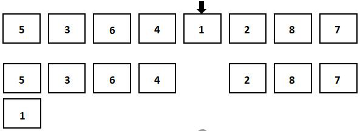
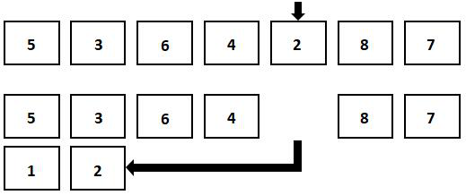
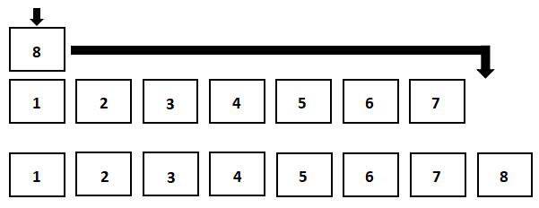
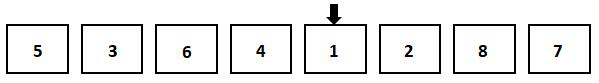
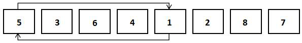
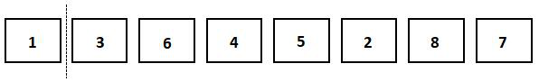
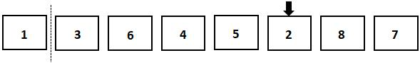
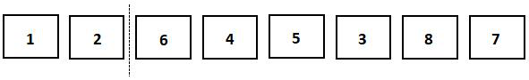
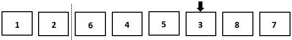
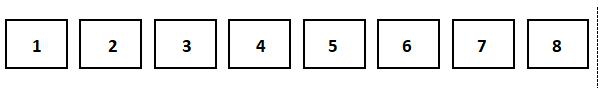

选择排序表示从无序的数组中，每次选择最小或最大的数据，从无序数组中放到有序数组的末尾，以达到排序的效果。

选择排序的平均时间复杂度，最好情况下的时间复杂度$O(n^2)$，最坏情况下的时间复杂度都是$O(n^2)$。另外，它是一个不稳定的排序算法。

## 1. 选择排序

选择排序的过程很容易理解。如下图所示，我们仍以递增排序的算法为例，先遍历未排序的数组，找到最小的元素。然后，把最小的元素从未排序的数组中删除，添加到有序数组的末尾。




因为最小的元素是1，所以1被添加到仍为空的有序数组末尾。

如下图所示，我们继续对剩余元素进行遍历。这次，最小的元素是2。我们把它添加到已排序的数组末尾。由于已在有序数组中的元素必定小于未排序数组中的所有元素，所以这步操作是正确无误的。



如下图所示，重复上述步骤，当未排序数组中只剩下一个元素时，把它添加到已排序的数组末尾，整个数组的排序就完成了。



采用图中的思路，以下代码将数组 nums 进行正序排序。

选择排序代码（基础版）：

```python
nums = [5, 3, 6, 4, 1, 2, 8, 7]
res = []  # 用于存储已排序元素的数组
while len(nums):  # 当未排序数组内还有元素时，重复执行选择最小数的代码
    minInd = 0  # 初始化存储最小数下标的变量，默认为第一个数
    for i in range(1, len(nums)):
        if (nums[i] < nums[minInd]):  # 更新最小数的下标
            minInd = i
    temp = nums[minInd]
    nums.pop(minInd)  # 把最小数从未排序数组中删除
    res.append(temp)  # 把最小数插入到已排序数组的末尾
print(res)
```

运行程序，输出结果为：

```python
[1, 2, 3, 4, 5, 6, 7, 8]
```

代码中，最外层的 while 循环用于判断是否所有的元素都已经进入有序的数组，从而确定排序是否已经完成。如果无序数组中已经没有元素，说明排序已经完成。

在开始遍历无序数组之前，先初始化记录最小值下标的变量为 0，所以 for 循环可以从第二个元素，也就是下标为1的元素开始遍历。找到最小值后，用 temp 存储最小数的值。执行 pop 函数把最小数从原数组中删除，这样它不会影响下一步的选择。最后，用 append 把 temp 存储的元素插入到有序数组末尾。

## 2. 选择排序改进版

虽然这样实现排序较为直观，代码逻辑也比较简单，但可以注意到，这样实现插入排序需要两个同样大小数组的空间。如果要处理的数据量较大，这样的算法会浪费资源。所以，我们要对算法做一些改动，使选择排序能够在同一个数组内完成。同样地，我们用图片来展示这个过程。

首先，如下图所示，在未排序的数组中找到最小的数1。



此时，它是我们找到的第一个最小数。如下图所示，我们把它与数组的第一个元素交换。




如下图所示，这时候，数组中的第一个位置就成为了有序数据的一部分。



接下来，如下图所示，由于第一个元素已经有序了，所以我们只需要在它之后的数组中搜索最小值。这一趟搜索过后，最小值是 2，所以把 2 和第二个元素交换位置。



如下图所示，2 和第二个元素交换位置后，第二个位置就成为了这个有序数组的一部分。




接下来，如下图所示，继续重复以上步骤，直到所有元素都被加入到有序数组中。下面给出了确定第三小的数的过程。



如下图，当所有元素都加入有序数组后，排序就完成了。



使用这样的思路，我们可以使用代码实现选择排序。

选择排序代码（原地版）：

```python
nums = [5, 3, 6, 4, 1, 2, 8, 7]
for i in range(len(nums) - 1):  # 更新有序数组的末尾位置
    minInd = i
    for j in range(i, len(nums)):  # 找出未排序数组中最小值的下标
        if nums[j] < nums[minInd]:
            minInd = j
    nums[i], nums[minInd] = nums[minInd], nums[i]  # 把最小值加到有序数组末尾
print(nums)
```

运行程序，输出结果为：

```python
[1, 2, 3, 4, 5, 6, 7, 8]
```

在程序中，第一个 for 循环中的i代表了有序数组之后的第一个位置，也就是未排序数组中的第一个位置。随后，再使用一个 for 循环，在未排序数组中找到最小值的下标。首先，把最小值下标 minInd 初始化为未排序数组中第一个元素的下标。随后，遍历整个数组，遇到比目前的最小值更小的元素时，更新下标即可。找出最小值后，把它和未排序数组中的第一个元素交换位置，这时它就成为了有序数组中的最后一个元素。

## 3. 小结

本节介绍了选择排序算法，在其他一些编程语言中，不能像 Python 一样使用 pop、insert 等函数对数组进行操作。插入一个数时，需要把插入位置及后面的所有元素都向后移动一位。这时候，本小节中的原地版算法优势更加明显。


欢迎关注我公众号：AI悦创，有更多更好玩的等你发现！

::: details 公众号：AI悦创【二维码】


:::

::: info AI悦创·编程一对一

AI悦创·推出辅导班啦，包括「Python 语言辅导班、C++ 辅导班、java 辅导班、算法/数据结构辅导班、少儿编程、pygame 游戏开发」，全部都是一对一教学：一对一辅导 + 一对一答疑 + 布置作业 + 项目实践等。当然，还有线下线上摄影课程、Photoshop、Premiere 一对一教学、QQ、微信在线，随时响应！微信：Jiabcdefh

C++ 信息奥赛题解，长期更新！长期招收一对一中小学信息奥赛集训，莆田、厦门地区有机会线下上门，其他地区线上。微信：Jiabcdefh

方法一：[QQ](http://wpa.qq.com/msgrd?v=3&uin=1432803776&site=qq&menu=yes)

方法二：微信：Jiabcdefh

:::


