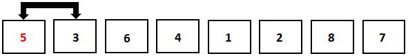
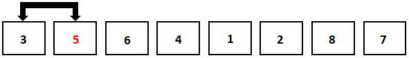
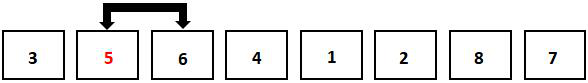
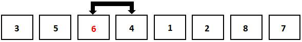
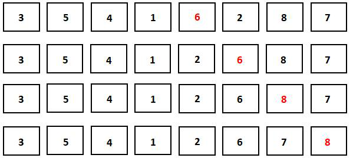
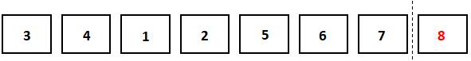
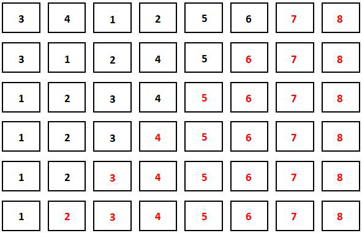

你好，我是悦创。

最后一种基础排序是冒泡排序。算法采用重复遍历数组并依次比较相邻元素的方法来排序。由于在冒泡算法进行排序的过程中，最大数或者最小数会慢慢“浮”到数组的末尾，所以算法由此命名。

冒泡排序的平均时间复杂度是 $O(n^2)$，最好情况下的时间复杂度是 $O(n)$, 最坏情况下的时间复杂度是 $O(n^2)$。空间复杂度是 $O(1)$。冒泡排序算法是一个稳定的排序算法。

冒泡排序的过程同样可以用图片说明。我们的目标还是把无序数组以从小到大的顺序排列。

## 1. 冒泡排序原理

首先，如下图所示，我们从第一个数开始遍历。将第一个数与它后面的元素进行对比，发现后面的元素比它小。



这时候，如下图所示，我们需交换这两个元素的值。



接下来遍历到的是第二个元素。如下图所示，此时第二个元素的值已经变为 5。把它和它后方的元素 6 对比，发现 5 和 6 的排列顺序已经是正确的（前面的数小于后面的数），这时候不用进行元素交换，直接继续遍历。



如下图所示，遍历到第三个元素时，发现它比后面的元素更大，这时候就继续交换这两个元素的值。



如图所示，在类似的一系列操作后，数组中的最大值被交换到了数组中的最后一个（第8个）位置上。



如图所示，这时候，我们可以确定末尾元素的值是正确的，所以接下来我们只需要对第1-7个位置上的元素再进行遍历了。



在对第 1-7 个位置上的的元素进行遍历之后，我们可以确定排在第 7 位的数。同理，在对第 1-6 个位置上的元素，第 1-5 个位置上的元素等进行遍历后，我们可以确定数组中排在第6位，第 5 位的数等。冒泡排序的剩下过程如图所示。



但是，我们发现，在排好第五个数之后，整个数组的排序就已经完成了，在接下来的遍历中不会再产生元素的交换。这时候，我们可以直接结束遍历。

## 2. 冒泡排序代码

了解了冒泡排序的流程之后，我们再来看看冒泡排序的代码。

冒泡排序的代码：

::: code-tabs

@tab 1

```python
nums = [5,3,6,4,1,2,8,7]
for i in range(len(nums),0,-1): #更新本趟遍历确定的元素位置
   	flag = 0 		#flag用于标记是否有元素交换发生
  	for j in range(i-1): #遍历未排序的数组
      	if nums[j]>nums[j+1]:
       		nums[j],nums[j+1] = nums[j+1],nums[j]
       		flag = 1 #标记存在元素交换
   	if not flag: 
      	break #如果本趟遍历没有经历元素交换，直接跳出循环         
print(nums)
```

@tab 2

```python
nums = [5,3,6,4,1,2,8,7] 
for i in range(len(nums),0,-1):  # 从列表的末尾开始遍历，因为冒泡排序是每一趟将最大的元素"冒泡"到列表的末尾
    flag = 0                     # 初始设定flag为0，表示没有元素交换发生
    for j in range(i-1):          # 遍历未排序的列表
        if nums[j]>nums[j+1]:     # 如果当前元素大于后一个元素，则交换它们的位置
            nums[j],nums[j+1] = nums[j+1],nums[j]
            flag = 1              # 如果发生交换，则将flag设为1
    if not flag:                  # 如果一趟遍历结束后flag仍然为0，表示没有发生过交换，即列表已经排序好
        break                     # 直接跳出循环
print(nums)                       # 打印排序好的列表
```

:::

运行程序，输出结果为：

```python
[1,2,3,4,5,6,7,8]
```

这段冒泡排序的代码中使用了两个 for 循环。外层 for 循环中的i代表每一次遍历后确定位置的元素的下标。

变量 flag 用于记录是否有元素交换发生，初始为 0，在遍历开始后，一旦两位元素进行交换，它的值就会变为 1。

随后，再用一个 for 循环对未排序数组进行遍历。为什么遍历的范围是 `range(i-1)` ？因为未排序数组的最后一个元素下标为 i，而我们在遍历时要同时访问下标为 j 和 j+1 的元素。把遍历范围设为 `range(i-1)` ，访问数组时才不会越界。另一个需要注意的点是交换元素的条件：`num[j] > num[j+1]`。注意不要把大于号写成大于等于号。当这两个元素相等时，为保留它们的原有相对位置，不要进行交换。如果把运算符写成大于等于号，排序算法的稳定性就被破坏了。

遍历结束后，如果 flag 的值仍然是 0，那么说明在整一次遍历中没有元素交换发生，也就是说，所有元素都是有序排列的。这时候就可以直接跳出循环，节省时间。

## 3. 小结

初级排序算法至此结束了。掌握了初级排序算法之后，我们再进入高级排序算法的学习。


<Share colorful />

欢迎关注我公众号：AI悦创，有更多更好玩的等你发现！

::: details 公众号：AI悦创【二维码】


:::

::: info AI悦创·编程一对一

AI悦创·推出辅导班啦，包括「Python 语言辅导班、C++ 辅导班、java 辅导班、算法/数据结构辅导班、少儿编程、pygame 游戏开发」，全部都是一对一教学：一对一辅导 + 一对一答疑 + 布置作业 + 项目实践等。当然，还有线下线上摄影课程、Photoshop、Premiere 一对一教学、QQ、微信在线，随时响应！微信：Jiabcdefh

C++ 信息奥赛题解，长期更新！长期招收一对一中小学信息奥赛集训，莆田、厦门地区有机会线下上门，其他地区线上。微信：Jiabcdefh

方法一：[QQ](http://wpa.qq.com/msgrd?v=3&uin=1432803776&site=qq&menu=yes)

方法二：微信：Jiabcdefh

:::


