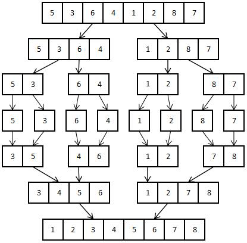

## 1. 归并排序原理

先来看第一种高级排序算法：归并排序。“归并”一词出自《后汉书》，意为“合并”。

顾名思义，归并排序算法就是一个先把数列拆分为子数列，对子数列进行排序后，再把有序的子数列合并为完整的有序数列的算法。它实际上采用了分治的思想，我们会在后面文章中深度讲解分治思想。

归并排序的平均时间复杂度是 $O(nlogn)$，最好情况下的时间复杂度是$O(nlogn)$, 最坏情况下的时间复杂度也是$O(nlogn)$。它的空间复杂度是 $O(1)$，另外还是一个稳定的排序算法。

以升序排序为例，归并算法的流程就如下图所示。



原始数组是一个有八个数的无序数组。一次操作后，把八个数的数组分成两个四个数组成的无序数组。接下来的每次操作都是把无序数组不停分成两半，直到每个最小的数组里都只有一个元素为止。

**<span style="color: orange">当数组里只有一个元素时，这个数组必定是有序的。</span>**

然后，程序开始把小的有序数组每两个合并成为大的有序数组。先是从两个 1 个数的数组合并成 2 个数的数组，再到 4 个数然后 8 个数。这时候，所有的有序数组全部合并完成，最后产生的最长的有序数组就排序完成了。

## 2. 归并排序代码

归并排序代码：

```python
#归并排序
nums = [5,3,6,4,1,2,8,7]
def MergeSort(num): 
    if(len(num)<=1): 				#递归边界条件
        return num 				#到达边界时返回当前的子数组
    mid = int(len(num)/2) 			#求出数组的中
    llist,rlist = MergeSort(num[:mid]),MergeSort(num[mid:])#调用函数分别为左右数组排序
    result = []
    i,j = 0,0
    while i < len(llist) and j < len(rlist): #while循环用于合并两个有序数组
        if rlist[j]<llist[i]:
            result.append(rlist[j])
            j += 1
        else:
            result.append(llist[i])
            i += 1
    result += llist[i:]+rlist[j:] 	#把数组未添加的部分加到结果数组末尾
    return result 					#返回已排序的数组
print(MergeSort(nums))
```

运行程序，输出结果为：

```python
[1, 2, 3, 4, 5, 6, 7, 8]
```

在 MergeSort 函数中，首先进行的是边界条件判断。当传进函数的数组长度只有 1 时，每一个数独立存在于一个数组中，因此数组已经被分到最小。这时候，递归分解数组的任务已经完成，只需要把分解后的数组返回到上一层递归就可以了。

如果未排序数组的长度仍然大于 1，那么使用变量 mid 来存储数组最中间的下标，把未排序数组分成左右两个子数组。然后，新建两个数组，用于存储排好序的左右子数组。这里使用了递归的思想。我们只把 MergeSort 函数视为一个为列表排序的函数，尽管在 MergeSort 函数内部，也可以调用函数本身对两个子数组进行排序。

## 3. 小结

相比起初级排序算法，高级排序算法往往有更加复杂的逻辑，但也会有更高的时间或空间效率。其中有些高级排序算法是由前面小节中所讲的初级排序算法优化而来的。在处理大量数据时，被归类为高级的排序算法一般更加常用。

## 4. 分步实现

归并排序是一种分而治之的排序算法，其基本原理是将一个大列表分成两个小列表，然后将这两个小列表各自排序，最后将排序后的两个小列表归并成一个有序列表。 

我们先从简单的部分开始，分解归并排序为以下步骤：

1. **分解**：如果列表中只有 0 个或 1 个元素，那么它已经是排序好的。如果列表中有 2 个或更多的元素，我们就把它分成两个小列表。

2. **解决**：我们用归并排序法对两个小列表进行排序。

3. **合并**：我们把两个排序好的小列表归并成一个大的，排序好的列表。

现在我们来实现这个算法。首先，我们需要一个 `merge` 函数来合并两个已排序的列表：

```python
def merge(left, right):
    result = []
    i = j = 0

    while i < len(left) and j < len(right):
        if left[i] <= right[j]:
            result.append(left[i])
            i += 1
        else:
            result.append(right[j])
            j += 1

    while i < len(left):
        result.append(left[i])
        i += 1

    while j < len(right):
        result.append(right[j])
        j += 1

    return result
```

这个函数做的就是：只要左边和右边的列表都有元素，就比较两边最小的元素并把它添加到结果列表中，然后将那边的索引+1。当左边或右边的列表没有元素时，就把另一边剩下的元素全部添加到结果列表中。

然后我们需要`merge_sort`函数来实现分解和解决步骤：

```python
def merge_sort(lst):
    if len(lst) <= 1:  # 基线条件：为空或只包含一个元素的列表总是有序的
        return lst

    mid = len(lst) // 2
    left = merge_sort(lst[:mid])  # 递归地排序左半部分
    right = merge_sort(lst[mid:])  # 递归地排序右半部分

    return merge(left, right)  # 合并两个有序列表
```

这个函数首先检查基线条件：如果列表为空或只包含一个元素，就返回列表本身，因为这样的列表总是有序的。否则，它将列表分成两半，并递归地对它们进行排序，然后把排序好的两个列表归并在一起。

那么现在你就可以测试你的归并排序算法了：

```python
print(merge_sort([38, 27, 43, 3, 9, 82, 10]))
```

这个程序将输出：`[3, 9, 10, 27, 38, 43, 82]`，这就是原列表的排序版本。

---


让我们从归并排序的基本概念开始。归并排序是一种典型的分治算法，它的基本思想是：将一个大问题分解成小的子问题来解决。小的子问题解决了，那么原来的大问题也就解决了。在归并排序中，这个大问题就是“如何排序一个序列”，小问题就是“如何排序一个子序列”，并且，这个子序列相对于原序列来说，规模小了一半。

以下是实现归并排序的Python代码及其详细注释。

首先，我们定义了一个名为`merge`的函数，该函数将两个已经排序的列表（我们称之为 left 和 right）合并为一个大的排序列表。

```python
def merge(left, right):
    result = []  # 创建一个空列表，用于存放排序结果
    i = j = 0  # 初始化两个指针 i 和 j，分别指向 left 和 right 的第一个元素

    # 当 i 和 j 都在各自的列表范围内时
    while i < len(left) and j < len(right):
        # 如果左边的元素小于或等于右边的元素
        if left[i] <= right[j]:
            result.append(left[i])  # 将左边的元素添加到结果列表中
            i += 1  # 将指针 i 向右移动一位，以指向下一个元素
        else:  # 如果左边的元素大于右边的元素
            result.append(right[j])  # 将右边的元素添加到结果列表中
            j += 1  # 将指针 j 向右移动一位，以指向下一个元素

    # 当 i 或 j 中的任何一个超出各自的列表范围时，退出循环
    # 如果左边列表还有剩余元素，则全部追加到结果列表中
    while i < len(left):
        result.append(left[i])
        i += 1

    # 如果右边列表还有剩余元素，则全部追加到结果列表中
    while j < len(right):
        result.append(right[j])
        j += 1

    return result  # 返回排序后的结果列表
```

然后，我们实现`merge_sort`函数，它是一个递归函数。给定一个列表，如果列表只有一个或零个元素，那么这个列表已经排序好了，我们直接返回这个列表。否则，我们将列表分为两部分，然后对每一部分递归地调用`merge_sort`，最后将排序好的两部分使用`merge`函数合并。

```python
def merge_sort(lst):
    # 如果列表只有一个元素或者没有元素，那么这个列表已经是排序好的
    if len(lst) <= 1:
        return

 lst

    # 找到列表的中间位置
    mid = len(lst) // 2

    # 对列表的左半部分进行排序
    left = merge_sort(lst[:mid])

    # 对列表的右半部分进行排序
    right = merge_sort(lst[mid:])

    # 将排序好的两部分合并
    return merge(left, right)
```

现在，你可以调用`merge_sort`函数来对一个列表进行排序。

```python
print(merge_sort([38, 27, 43, 3, 9, 82, 10]))
# 输出: [3, 9, 10, 27, 38, 43, 82]
```

以上就是归并排序的完整实现，以及每行代码的详细注释。希望这些信息对你有所帮助。如果你对任何部分有疑问，请随时向我提问。


欢迎关注我公众号：AI悦创，有更多更好玩的等你发现！

::: details 公众号：AI悦创【二维码】


:::

::: info AI悦创·编程一对一

AI悦创·推出辅导班啦，包括「Python 语言辅导班、C++ 辅导班、java 辅导班、算法/数据结构辅导班、少儿编程、pygame 游戏开发」，全部都是一对一教学：一对一辅导 + 一对一答疑 + 布置作业 + 项目实践等。当然，还有线下线上摄影课程、Photoshop、Premiere 一对一教学、QQ、微信在线，随时响应！微信：Jiabcdefh

C++ 信息奥赛题解，长期更新！长期招收一对一中小学信息奥赛集训，莆田、厦门地区有机会线下上门，其他地区线上。微信：Jiabcdefh

方法一：[QQ](http://wpa.qq.com/msgrd?v=3&uin=1432803776&site=qq&menu=yes)

方法二：微信：Jiabcdefh

:::


