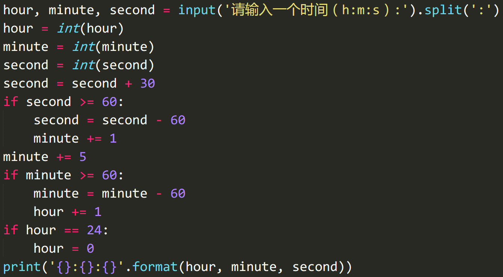
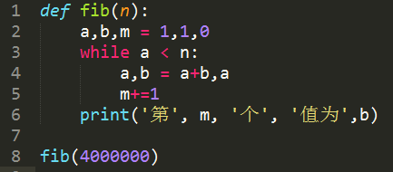
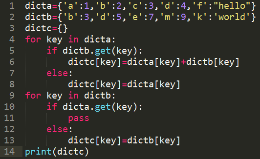

1. Python 中的可变数据类型有\_\_\_\_\_\_\_\_\_\_\_，不可变数据类型有\_\_\_\_\_\_\_\_\_\_\_。

::: tip 答案解析

正确答案：列表和字典；字符串、数字、元组

记忆性知识点

:::

2. 表达式 3 and not 5 的值为\_\_\_\_\_\_\_\_\_\_\_，不可变数据类型有\_\_\_\_\_\_\_\_\_\_\_。

::: tip 答案解析

正确答案：False

and 是 python 逻辑运算里的与运算。

在纯 and 语句中，如果每一个表达式都不是假的话，那么返回最后一个，因为需要一直匹配直到最后一个。

如果有一个是假，那么返回假。

从理论上来说他们都属于变量的位操作，即二进制的换算过程。

所有变量的位操作都是通过强制转换成 bool 实现的，并且表达式的值是从左到右第一个能够确定表达式的值的变量。

其中所有非 0 数字或非空对象均为 True，0、空对象及特殊对象 None 被视为 False。

3 and not 5 计算过程 ==(`Ture and False`)，逻辑运算中与计算的规则是如果有一个是 False，那么返回 False。

不可变数据类型有：略

:::

3. `input()` 函数的返回值是，不可变数据类型有\_\_\_\_\_\_\_\_\_\_\_类型。

::: tip 答案解析

正确答案：字符串

:::

4. 下面程序的执行结果是\_\_\_\_\_\_\_\_\_\_\_。


::: tip 答案解析

正确答案：1275

for 循环中有 `if i==50` 则输出 s 并跳出循环。即跳出循环时 s 的数值为 `0-50` 累加的计算结果。即 `0+1+2+3+…+50=1275`。

:::

5. 只要判断条件是非零数值、非空字符串、非空 list 等，就判断为 True，否则为 False。

A. √

B. X

::: tip 答案解析

正确答案：A 易错项：B

记忆性知识点

:::

6. Python 字符串方法 `replace()` 对字符串进行原地修改。

A. √

B. X

::: tip 答案解析

正确答案：B 易错项：A

在 Python 中，字符串属于不可变对象，不支持原地修改，如果需要修改其中的值，只能重新创建一个新的字符串对象。

:::

7. 可以使用 format 函数对字符串进行格式化。

A. √

B. X

::: tip 答案解析

正确答案：A 易错项：B

:::

8. 当以指定“键”为下标给字典对象赋值时，若该“键”存在则表示修改该“键”对应的“值”，若不存在则表示为字典对象添加一个新的“键-值对”。

A. √

B. X

::: tip 答案解析

正确答案：A 易错项：B

记忆性知识点

:::

9. Python 内置的字典 dict 中元素是按添加的顺序依次进行存储的。

A. √

B. X

::: tip 答案解析

正确答案：B 易错项：A

Python 内置字典是无序的，如果需要一个可以记住元素插入顺序的字典，可以使用 `collections.OrderedDict`。

:::

10. 下面的代码是否能够正确运行，若不能请解释原因；若能，请分析其执行结果。

```python
x = list(range(20))
for i in range(len(x)):
    del x[i]
```

::: tip 答案解析

正确答案：无法正确执行，因为删除列表元素时会影响其他元素在列表中的索引，上面的代码会抛出下标越界的异常。

:::

11. 请写出以下代码的执行结果：


::: tip 答案解析

正确答案：输出为： `Tom Jason is speaking: I am 20 years old`

代码定义了 People 类，并初始化属性为 `name='Tom'`, `age=18`。

然后使用构造函数 `__init__()` 对 name 属性和 age 属性进行重写，令其可接受实例化时的参数引用，并在 People 类里定义了一个 speak 函数用固定的格式来输出 name 和 age 属性。

接着新建了 p 作为 People 类的实例对象(也称为 People 类的实例化)，并在这个实例里将 name 属性定义为 Sunny，age 属性为 20。但并没有更改此时 People 类的 name 属性，所以 `People.name` 的输出值依旧为初始化中的 `'Tom'`。

接着使用 `p.name = 'Jason'` 语句将实例对象 p 的 name 属性更改为 Jason，即实例对象 p 的 speak 函数输出为 `"Jason is speaking: I am 20 years old"`。

:::

12. 编写程序: 输入长方形的长和宽,计算长方形的面积.

::: tip 答案解析

```python
# 参考代码:
l = input('长方形的长：')
b = input('长方形的宽：')
l = int(l)
b = int(b)
area = l * b
print('长方形的面积为：'+ str(area))
```

需要注意数据类型的一致性。input 函数默认的输入值为字符串，但相乘时需要转换成数字，输出时需要再转换为字符串。

:::

13. 输入一个时间(以“小时:分钟:秒”的格式)，输出该时间经过 5 分 30 秒后的时间。

::: tip 答案解析



:::

14. 斐波那契数列为`1,2,3,5,8,13,21.....`根据这样的规律，编程求出 400 万以内最大的斐波那契数，并求出他是第几个斐波那契数。

::: tip 答案解析



:::

15. 要求写一段代码，实现两个字典的相加，不同的 key 对应的值保留，相同的 key 对应的值相加后保留。

```python
dicta = {"a":1,"b":2,"c":3,"d":4,"f":"hello"}
dictb = {"b":3,"d":5,"e":7,"m":9,"k":"world"}
# 如上示例得到结果为：
dictc = {"a":1,"b":5,"c":3,"d":9,"e":7,"m":9,"f":"hello","k":"world"}
```

::: tip 答案解析



:::


欢迎关注我公众号：AI悦创，有更多更好玩的等你发现！

::: details 公众号：AI悦创【二维码】


:::

::: info AI悦创·编程一对一

AI悦创·推出辅导班啦，包括「Python 语言辅导班、C++ 辅导班、java 辅导班、算法/数据结构辅导班、少儿编程、pygame 游戏开发」，全部都是一对一教学：一对一辅导 + 一对一答疑 + 布置作业 + 项目实践等。当然，还有线下线上摄影课程、Photoshop、Premiere 一对一教学、QQ、微信在线，随时响应！微信：Jiabcdefh

C++ 信息奥赛题解，长期更新！长期招收一对一中小学信息奥赛集训，莆田、厦门地区有机会线下上门，其他地区线上。微信：Jiabcdefh

方法一：[QQ](http://wpa.qq.com/msgrd?v=3&uin=1432803776&site=qq&menu=yes)

方法二：微信：Jiabcdefh

:::


