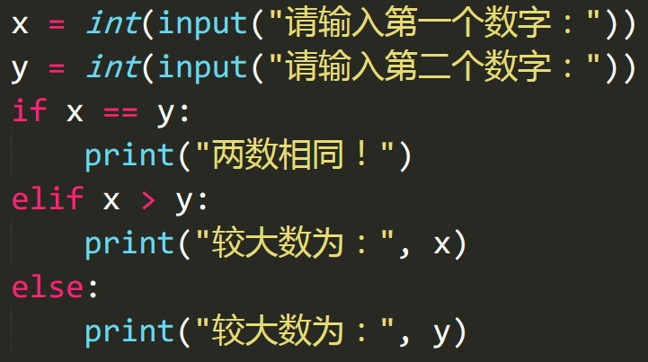
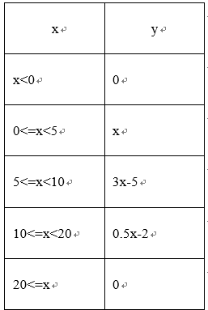
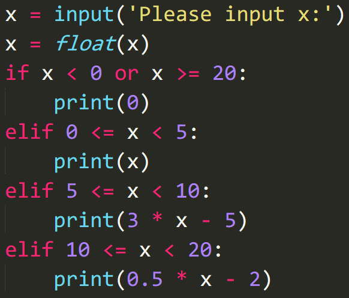
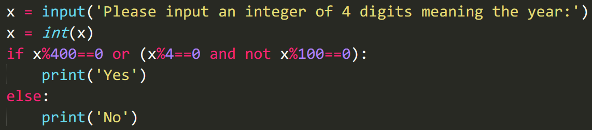

1.  Python中用于表示逻辑与、逻辑或、逻辑非运算的关键字分别是\_\_\_\_\_\_\_\_\_、\_\_\_\_\_\_\_\_\_\_\_、\_\_\_\_\_\_\_\_\_。
    

::: tip 答案解析

正确答案：and、or、not 记忆性知识点

:::    

2.  表达式 `5>10 and 2<5`  的值为\_\_\_\_\_\_\_\_\_。
    

::: tip 答案解析

正确答案：False

:::    

3.  if 语句之后的布尔表达式值为\_\_\_\_\_\_\_时，则对应的语句会被执行。如果其值为\_\_\_\_\_\_\_，则语句不会被执行。
    

::: tip 答案解析

正确答案：True;False

:::    

4. 在条件表达式中不允许使用赋值运算符 `=` ，会提示语法错误。 

    A. √ 

    B. X

::: tip 答案解析

正确答案：A 

易错项：B 记忆性知识点

:::    

5. 自定义的函数里只能有一个 elif 判断语句。 

    A. √ 

    B. X

::: tip 答案解析

正确答案：B 

易错项：A 可以有多个 elif 判断语句

:::    

6. if 语句的执行顺序是从上往下执行的。 

    A. √ 

    B. X

::: tip 答案解析

正确答案：A 

易错项：B 记忆性知识点

:::    

7. 尝试编写一个 Python 程序，输入两个数，比较它们的大小并输出其中较大者。




8. 尝试编写程序，实现分段函数计算，如下表所示：





9.  尝试编写程序，运行后用户输入 4 位整数作为年份，判断其是否为闰年。如果年份能被 400 整除，则为闰年；如果年份能被4整除但不能被 100 整除也为闰年。
    



10. 尝试编写程序，判断一个数是否为奇数或偶数。

```python
num = int(input("请输入一个整数："))

if num % 2 == 0:
    print("这是一个偶数")
else:
    print("这是一个奇数")
```

11. 尝试编写程序，判断一个数字是否在指定范围内「例如：5～15」。

```python
lower = 5
upper = 15
num = int(input("请输入一个整数："))

if lower <= num <= upper:
    print(f"{num} 在范围 {lower}-{upper} 内")
else:
    print(f"{num} 不在范围 {lower}-{upper} 内")
```

12. 尝试编写程序，判断一个字符是否为元音。

```python
char = input("请输入一个字母：").lower()

if char in ['a', 'e', 'i', 'o', 'u']:
    print(f"{char} 是一个元音")
else:
    print(f"{char} 不是一个元音")
```

13. 尝试编写程序，根据用户输入的成绩，给出评级。

| 分数   | 评级 |
| ------ | ---- |
| 90     | A    |
| 80     | B    |
| 70     | C    |
| 60     | D    |
| 不及格 | F    |

```python
score = float(input("请输入你的成绩："))

if score >= 90:
    grade = "A"
elif score >= 80:
    grade = "B"
elif score >= 70:
    grade = "C"
elif score >= 60:
    grade = "D"
else:
    grade = "F"

print(f"你的评级为：{grade}")
```

欢迎关注我公众号：AI悦创，有更多更好玩的等你发现！

::: details 公众号：AI悦创【二维码】


:::

::: info AI悦创·编程一对一

AI悦创·推出辅导班啦，包括「Python 语言辅导班、C++ 辅导班、java 辅导班、算法/数据结构辅导班、少儿编程、pygame 游戏开发」，全部都是一对一教学：一对一辅导 + 一对一答疑 + 布置作业 + 项目实践等。当然，还有线下线上摄影课程、Photoshop、Premiere 一对一教学、QQ、微信在线，随时响应！微信：Jiabcdefh

C++ 信息奥赛题解，长期更新！长期招收一对一中小学信息奥赛集训，莆田、厦门地区有机会线下上门，其他地区线上。微信：Jiabcdefh

方法一：[QQ](http://wpa.qq.com/msgrd?v=3&uin=1432803776&site=qq&menu=yes)

方法二：微信：Jiabcdefh

:::


