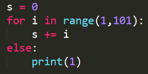
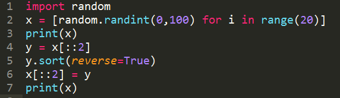

1. 如果仅仅是用于控制循环次数，那么使用 `for i in range(20)` 和 `for i in range(20, 40)` 的作用是_________的。

    A. 等价

    B. 不等价

::: tip 答案解析

正确答案：A 易错项：B

记忆性知识点

:::

2. 对于带有 else 子句的 for 循环和 while 循环，当循环因循环条件不成立而自然结束时________执行 else 中的代码。

    A. 会

    B. 不会

::: tip 答案解析

正确答案：A 易错项：B

记忆性知识点

:::

3. 运行 `for i in range(10,20,5): print(i)` ，输出为：

    A. 5 10

    B. 10 15

    C. 15 20

    D. 10 15 20

::: tip 答案解析

正确答案：B 易错项：D

`range(10,20,5)` 即在 10 到 20 (不包括 20)之间，每隔5取一个数。

:::

4. 下面的语句哪个会无限循环下去：
    A. `for a in range(10): time.sleep(10)`

    B. `while 1<10: time.sleep(10)`

    C. `while True: break`

    D. `a = [3,-1,','] for i in a[:]: if not a: break`

::: tip 答案解析

正确答案：B 易错项：C

A 中的 for 循环是从 a=0 循环至 a=9，则当 a=10 时自动跳出循环；C 中有 break 语句，可跳出当前 while True 形成的死循环；D 中同理可以用 break 语句跳出当前的死循环。

:::

5. (多选题) 下面的代码，哪些会输出1,2,3 三个数字(多选):
    A. `for i in range(3): print(i)`

    B. `aList = [0,1,2] for i in aList: print(i+1)`

    C. `i = 1 while i < 3: print(i) i+=1`

    D. `for i in range(3): print(i+1)`

::: tip 答案解析

正确答案：B,D 易错项：C

A 输出 0，1，2、C 输出1，2。其中 C 的 while 函数是先输出再执行 i+1，则当 i=3 时已经不符合 while 循环的条件，即跳出循环，不会输出 i 的当前值。

:::

6. Python 3.x 语句 `for i in range(3):print(i, end=',')` 的输出结果为_____________________。 

::: tip 答案解析

正确答案：`(0,1,2,)`

:::

7. 下面程序的执行结果是__________________。

::: tip 答案解析

正确答案：1

for 循环里生成了 0-100 的累加效果，但累加的最终结果并没有输出。当 for 循环结束之后进入 else 的 print() 输出函数才得到了程序的执行结果：1。

:::

8. 编写程序，生成一个包含 20 个随机整数的列表，然后对其中偶数下标的元素进行降序排列，奇数下标的元素不变。(提示：使用切片。)

欢迎关注我公众号：AI悦创，有更多更好玩的等你发现！

::: details 公众号：AI悦创【二维码】

:::

::: info AI悦创·编程一对一

AI悦创·推出辅导班啦，包括「Python 语言辅导班、C++ 辅导班、java 辅导班、算法/数据结构辅导班、少儿编程、pygame 游戏开发」，全部都是一对一教学：一对一辅导 + 一对一答疑 + 布置作业 + 项目实践等。当然，还有线下线上摄影课程、Photoshop、Premiere 一对一教学、QQ、微信在线，随时响应！微信：Jiabcdefh

C++ 信息奥赛题解，长期更新！长期招收一对一中小学信息奥赛集训，莆田、厦门地区有机会线下上门，其他地区线上。微信：Jiabcdefh

方法一：[QQ](http://wpa.qq.com/msgrd?v=3&uin=1432803776&site=qq&menu=yes)

方法二：微信：Jiabcdefh

:::

