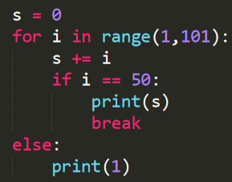
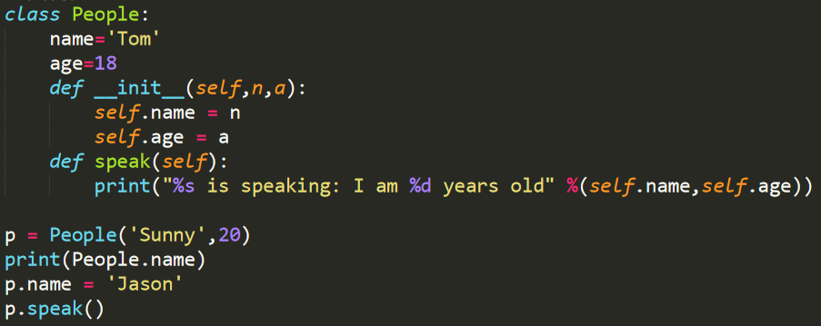

1. Python 中的可变数据类型有\_\_\_\_\_\_\_\_\_\_\_，不可变数据类型有\_\_\_\_\_\_\_\_\_\_\_。
2. 表达式 3 and not 5 的值为\_\_\_\_\_\_\_\_\_\_\_，不可变数据类型有\_\_\_\_\_\_\_\_\_\_\_。
3. `input()` 函数的返回值是，不可变数据类型有\_\_\_\_\_\_\_\_\_\_\_类型。
4. 下面程序的执行结果是\_\_\_\_\_\_\_\_\_\_\_。



5. 只要判断条件是非零数值、非空字符串、非空 list 等，就判断为 True，否则为 False。

A. √

B. X

6. Python 字符串方法 `replace()` 对字符串进行原地修改。

A. √

B. X

7. 可以使用 format 函数对字符串进行格式化。

A. √

B. X

8. 当以指定“键”为下标给字典对象赋值时，若该“键”存在则表示修改该“键”对应的“值”，若不存在则表示为字典对象添加一个新的“键-值对”。

A. √

B. X

9. Python 内置的字典 dict 中元素是按添加的顺序依次进行存储的。

A. √

B. X

10. 下面的代码是否能够正确运行，若不能请解释原因；若能，请分析其执行结果。

```python
x = list(range(20))
for i in range(len(x)):
    del x[i]
```

11. 请写出以下代码的执行结果：



12. 编写程序: 输入长方形的长和宽,计算长方形的面积.
13. 输入一个时间(以“小时:分钟:秒”的格式)，输出该时间经过 5 分 30 秒后的时间。
14. 斐波那契数列为`1,2,3,5,8,13,21.....`根据这样的规律，编程求出 400 万以内最大的斐波那契数，并求出他是第几个斐波那契数。
15. 要求写一段代码，实现两个字典的相加，不同的 key 对应的值保留，相同的 key 对应的值相加后保留。

```python
dicta = {"a":1,"b":2,"c":3,"d":4,"f":"hello"}
dictb = {"b":3,"d":5,"e":7,"m":9,"k":"world"}
# 如上示例得到结果为：
dictc = {"a":1,"b":5,"c":3,"d":9,"e":7,"m":9,"f":"hello","k":"world"}
```


欢迎关注我公众号：AI悦创，有更多更好玩的等你发现！

::: details 公众号：AI悦创【二维码】


:::

::: info AI悦创·编程一对一

AI悦创·推出辅导班啦，包括「Python 语言辅导班、C++ 辅导班、java 辅导班、算法/数据结构辅导班、少儿编程、pygame 游戏开发」，全部都是一对一教学：一对一辅导 + 一对一答疑 + 布置作业 + 项目实践等。当然，还有线下线上摄影课程、Photoshop、Premiere 一对一教学、QQ、微信在线，随时响应！微信：Jiabcdefh

C++ 信息奥赛题解，长期更新！长期招收一对一中小学信息奥赛集训，莆田、厦门地区有机会线下上门，其他地区线上。微信：Jiabcdefh

方法一：[QQ](http://wpa.qq.com/msgrd?v=3&uin=1432803776&site=qq&menu=yes)

方法二：微信：Jiabcdefh

:::

