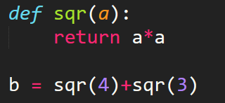

1. Python 中定义函数的关键字是_________________。
2. 如果函数中没有 return 语句或者 return 语句不带任何返回值，那么该函数的返回值为_________________。
3. 一般使用4个_________________或者1个_________________来表示函数的缩进。
4. 如果想要在 sublime text3 中将一段代码前都加上 Tab 键，可以将此段代码刷黑之后使用_________________快捷键。
5. 函数体内的 pass 语句一般作为占位符或者创建占位程序，对此 python 不会执行任何操作。

A. √

B. X

6. Python 函数里的返回值只能返回一个值。

A. √

B. X

7. 函数是通过函数名来进行调用的，但函数也可以当做参数被其他参数调用。

A. √

B. X

8. 若一个 python 程序中命名了多个相同的函数名，则调用该函数时会执行最初定义的函数。

A. √

B. X

9. 函数名命名时应遵循变量的命名规则。

A. √

B. X

10. 定义函数时，即使该函数不需要接收任何参数，也必须保留一对空的圆括号来表示这是一个函数。

A. √

B. X

11. 定义 Python 函数时必须指定函数返回值类型。

A. √

B. X

12. 相同缩进位置的代码表示他们是同一个代码块。

A. √

B. X

13. 自定义 Python 函数时可以在函数名称后的括号里不包含参数。

A. √

B. X

14. 请选择以下代码的作用：`def sth(a,b,c):pass`

A. 定义了一个什么都没做的函数

B. 定义了一个空元组

C. 定义了一个空列表

D. 定义了一个空字符串

15. 此题无需在线作答，请在纸上作答后查看答案解析

有程序如上图，则运行这个程序的结果是______。

16. 执行以下代码后，b 的值为_______

欢迎关注我公众号：AI悦创，有更多更好玩的等你发现！

::: details 公众号：AI悦创【二维码】

:::

::: info AI悦创·编程一对一

AI悦创·推出辅导班啦，包括「Python 语言辅导班、C++ 辅导班、java 辅导班、算法/数据结构辅导班、少儿编程、pygame 游戏开发」，全部都是一对一教学：一对一辅导 + 一对一答疑 + 布置作业 + 项目实践等。当然，还有线下线上摄影课程、Photoshop、Premiere 一对一教学、QQ、微信在线，随时响应！微信：Jiabcdefh

C++ 信息奥赛题解，长期更新！长期招收一对一中小学信息奥赛集训，莆田、厦门地区有机会线下上门，其他地区线上。微信：Jiabcdefh

方法一：[QQ](http://wpa.qq.com/msgrd?v=3&uin=1432803776&site=qq&menu=yes)

方法二：微信：Jiabcdefh

:::

