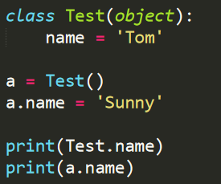

1. Python 使用\_\_\_\_\_\_\_\_\_\_\_\__\_\_\_\_关键字来定义类。

2. 类的概念体现了\_\_\_\_\_\_\_\_\_\_\_\_\__\_\_\_(面向对象/面向过程)的程序设计思想。

3. \_\_\_\_\_\_\_\_\_\_\_\_\__\_\_\_、\_\_\_\_\_\_\_\_\_\_\_\_\__\_\_\_、\_\_\_\_\_\_\_\_\_\_\_\_\__\_\_\_是面向对象的三大特点。
4. 类的函数里必须有\_\_\_\_\_\_\_\_\_\_\_\_\__\_\_\_参数。
5. 实例化的过程就是类到对象的过程。

A. √

B. X

6. 修改类会影响到所有的实例。

A. √

B. X

7. 修改某个实例里的属性，也会影响到类里的属性。

A. √

B. X

8. 实例是根据类创建出来的具体对象，每个对象都拥有相同的方法和数据。

A. √

B. X

9. 请写出以下代码的执行结果：



10. 请定义一个学生类。

    1. **有以下三个类属性：**

        1. 姓名
        2. 年龄
        3. 成绩(语文，数学，英语)[每课成绩的类型为整数]

    2. **类方法：**

        1. 获取学生的姓名：`get_name()` 返回类型: str
        2. 获取学生的年龄：`get_age()` 返回类型: int
        3. 返回 3 门科目中最高的分数。`get_course()` 返回类型: int

    3. **以下为测试结果：**

        ```python
        zm = Student('zhangming',20,[69,88,100])
        ```

    4. **返回结果：**

        ```python
        zhangming
        20
        100
        ```

欢迎关注我公众号：AI悦创，有更多更好玩的等你发现！

::: details 公众号：AI悦创【二维码】


:::

::: info AI悦创·编程一对一

AI悦创·推出辅导班啦，包括「Python 语言辅导班、C++ 辅导班、java 辅导班、算法/数据结构辅导班、少儿编程、pygame 游戏开发」，全部都是一对一教学：一对一辅导 + 一对一答疑 + 布置作业 + 项目实践等。当然，还有线下线上摄影课程、Photoshop、Premiere 一对一教学、QQ、微信在线，随时响应！微信：Jiabcdefh

C++ 信息奥赛题解，长期更新！长期招收一对一中小学信息奥赛集训，莆田、厦门地区有机会线下上门，其他地区线上。微信：Jiabcdefh

方法一：[QQ](http://wpa.qq.com/msgrd?v=3&uin=1432803776&site=qq&menu=yes)

方法二：微信：Jiabcdefh

:::

