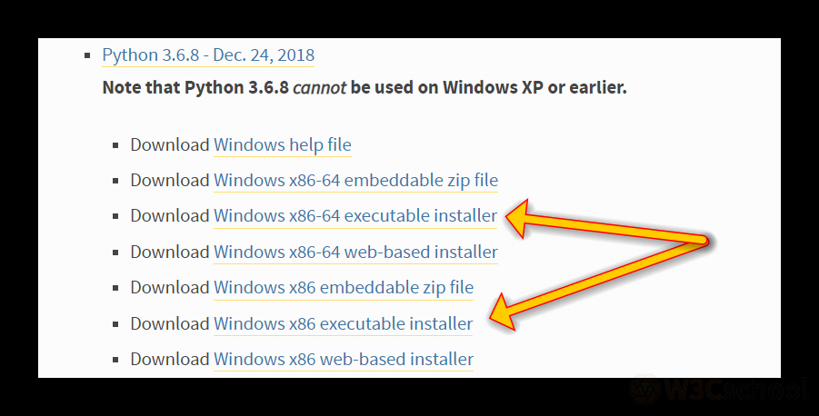
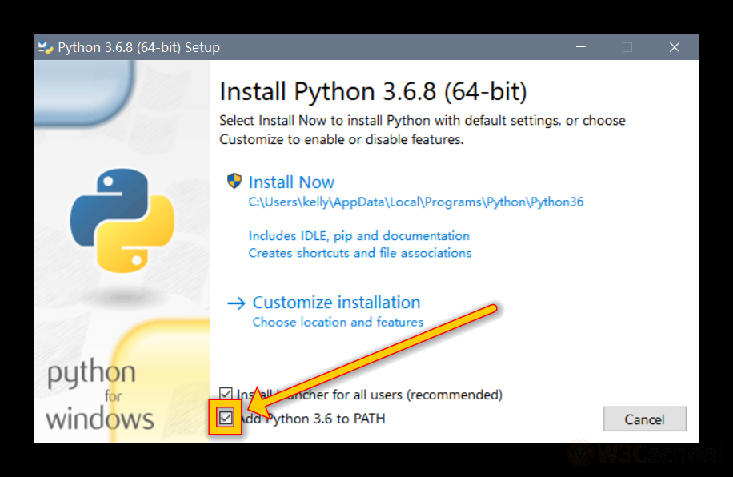
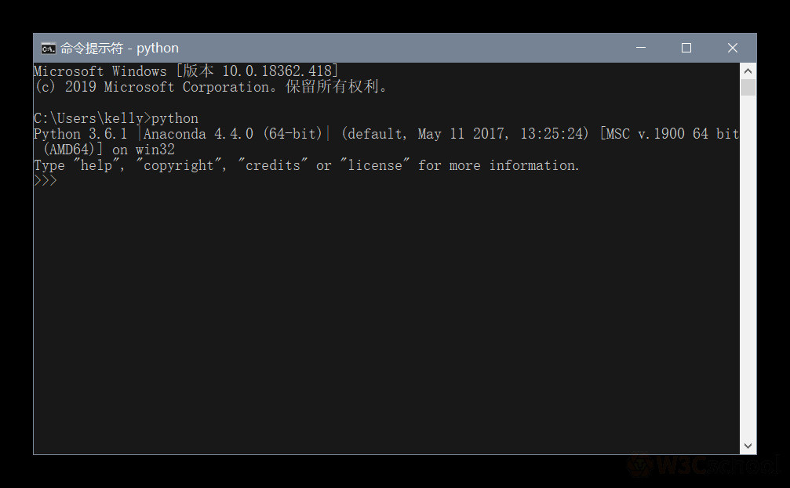

## 下载

（1）进入 [Python官网下载页面](https://www.python.org/downloads/windows/)，下载一个Python安装包，可用版本 3.5、3.6、3.7、3.8，推荐版本3.6或者3.8，所以这里用Python3.6做演示，如下图：

下载 32 位或者 64 位的 exe 执行安装包，不清楚 32 或者 64 的，一律下载 32 位【即 `x86` 】。

（2）下载后，双击 exe 文件，即可安装，不过要记得勾选 Add To Path，自动添加到环境变量，省的再去手工处理。

（3）点击安装后等待就行了，安装好之后打开 cmd，输入 Python，可以进入有 Python 输出和 `>>>` ，就表示你安装好了，如下：

安装好之后，就可以开始学习了。

欢迎关注我公众号：AI悦创，有更多更好玩的等你发现！

::: details 公众号：AI悦创【二维码】

:::

::: info AI悦创·编程一对一

AI悦创·推出辅导班啦，包括「Python 语言辅导班、C++ 辅导班、java 辅导班、算法/数据结构辅导班、少儿编程、pygame 游戏开发」，全部都是一对一教学：一对一辅导 + 一对一答疑 + 布置作业 + 项目实践等。当然，还有线下线上摄影课程、Photoshop、Premiere 一对一教学、QQ、微信在线，随时响应！微信：Jiabcdefh

C++ 信息奥赛题解，长期更新！长期招收一对一中小学信息奥赛集训，莆田、厦门地区有机会线下上门，其他地区线上。微信：Jiabcdefh

方法一：[QQ](http://wpa.qq.com/msgrd?v=3&uin=1432803776&site=qq&menu=yes)

方法二：微信：Jiabcdefh

:::

