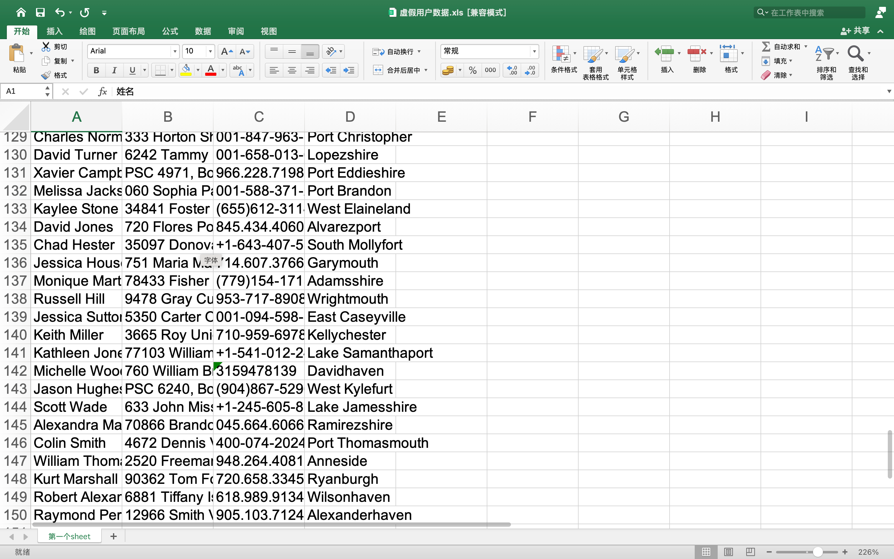

## xlutils 库的安装

你好，我是悦创。

### 需求

往“**虚假用户数据.xls**”里面，追加额外的 50 条用户数据，就是**标题+数据**，达到 150 条。

### 思路

- xlrd 是读取 Excel 文件的库
- xlwt 是写入 Excel 的库

如果使用以上两个库，可以一边读取，一边写入新文件。

不过在此，有另一个方便使用的库，库名是 xlutils，安装命令：`pip install xlutils`。

```cmd
pip install xlutils
```

安装好之后，开始写代码，完成追加 50 条数据的需求。

## 书写代码

1. 导入所需的库，分别是 xlrd 和 xlutils

```python
import xlrd
from xlutils.copy import copy
```

2. 使用 xlrd 打开文件，然后 xlutils 赋值打开后的 workbook，如下代码：

```python
wb = xlrd.open_workbook('虚假用户数据.xls', formatting_info=True)
xwb = copy(wb)
```

wb 对象是 workbook，xwb 也是 workbook，但是后者可以写操作，前者不可以。

3. 有了 workbook 之后，就开始指定 sheet，并获取这个 sheet 的总行数。

```python
sheet = xwb.get_sheet('第一个sheet')
rows = sheet.get_rows()
length = len(rows)
print(length)  # 输出 100
```

指定名称为“**第一个sheet**”的 sheet，然后获取全部的行，并输出总量，就得到了 sheet 中有 100 行。

4. 有了具体的行数，然后保证原有数据不变动的情况下，从第 101 行写数据。101 行的索引是 100，索引循环的起始数值是 100。

```python
import faker

fake = faker.Faker()
for i in range(len(rows), 150):
    sheet.write(i, 0, fake.first_name() + ' ' + fake.last_name())
    sheet.write(i, 1, fake.address())
    sheet.write(i, 2, fake.phone_number())
    sheet.write(i, 3, fake.city())
```

range 函数，从 `len(rows)` 开始，到 `150-1` 结束，共 50 条。 faker 库是制造虚假数据的，这个在前面写数据有用过，循环写入了 50条。

5. 最后保存就可以了

```python
xwb.save('虚假用户数据.xls')
```

使用 xwb，也就是操作之后的 workbook 对象，直接保存原来的文件名就可以了。

## Office 办公软件查看数据结果

最后使用 Excel 软件打开这个 xls 文件，查看数据有多少行，如下代码：



总共 150 行，原有数据 100 行，加上新写入的 50 行，数据没问题。

将以上的代码，合并起来多次运行，“**虚假用户数据.xls**” 的数据量会逐步增加，运行一次增加 50 行。

xlutils 是 `xlrd+xlwt` 的操作合集，但又不等于他们相加。库不一样，完成的操作不一样，所需的场景也不同，不同的需求用不同的库。

欢迎关注我公众号：AI悦创，有更多更好玩的等你发现！

::: details 公众号：AI悦创【二维码】


:::

::: info AI悦创·编程一对一

AI悦创·推出辅导班啦，包括「Python 语言辅导班、C++ 辅导班、java 辅导班、算法/数据结构辅导班、少儿编程、pygame 游戏开发」，全部都是一对一教学：一对一辅导 + 一对一答疑 + 布置作业 + 项目实践等。当然，还有线下线上摄影课程、Photoshop、Premiere 一对一教学、QQ、微信在线，随时响应！微信：Jiabcdefh

C++ 信息奥赛题解，长期更新！长期招收一对一中小学信息奥赛集训，莆田、厦门地区有机会线下上门，其他地区线上。微信：Jiabcdefh

方法一：[QQ](http://wpa.qq.com/msgrd?v=3&uin=1432803776&site=qq&menu=yes)

方法二：微信：Jiabcdefh

:::


