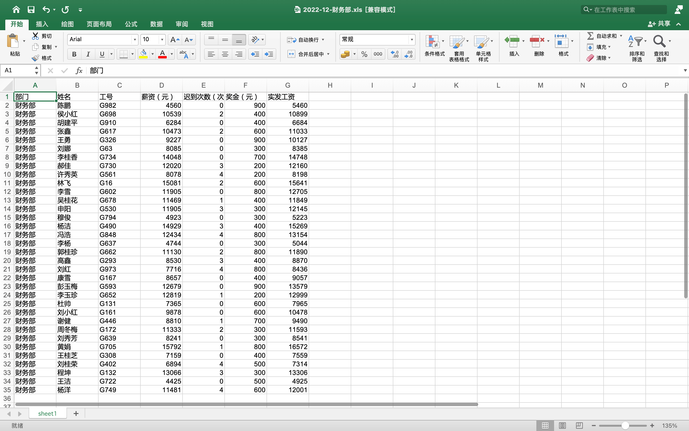
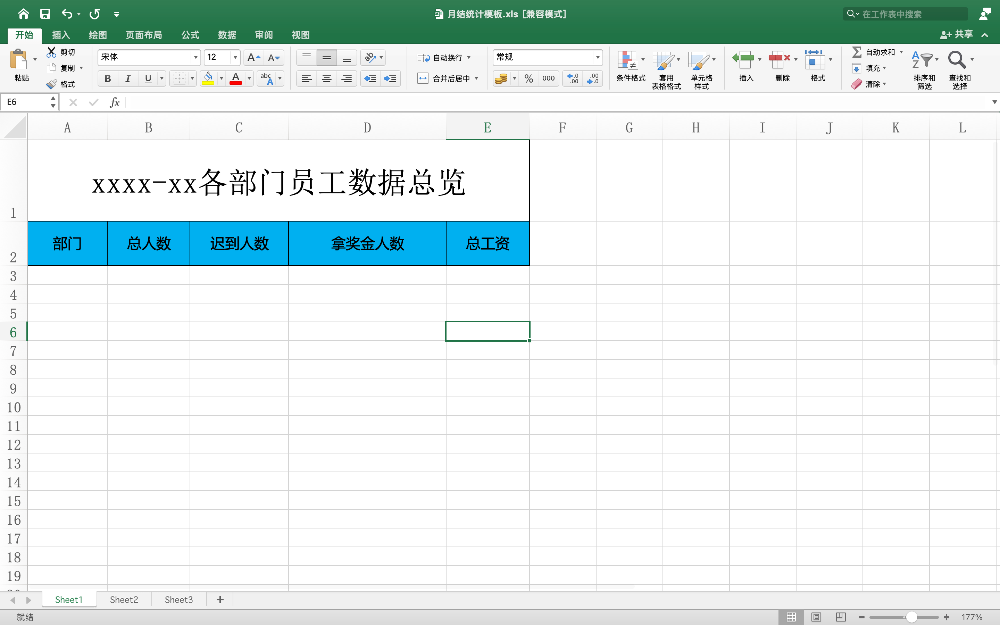

## 实例需求说明

学习了 Excel 文件的写入、读取和追加内容，那现在来做个案例。

需求描述并整理，如下：

- 每个月的 2 号，你会收到一个 Excel 文件；
- 文件中包含了 各个部门的员工信息；
- 你需要一天之内完成这些报表的整理和统计，然后交给领导检查和发放工资；
- 时间要快，工资发晚了，同事会抱怨你；
- 工作量还是比较大的，你需要解放双手，让程序去处理问题
- 让程序快速的计算出每个人的工资，并将统计信息结合模板，生成“`xxxx年xx月各部门员工数据总览`”；
- 薪资计算规定：迟到一次扣 20，一个月最多扣 200；

简单的财务自动化结算需求，并且给出了各部门的工资表格文件和统计报表的模板文件。

## 需求说明图示

简单的财务自动化结算需求，并且给出了各部门的工资表格文件和统计报表的模板文件，截图如下：


“`批量生成财务报表.ipynb`”这个文件里面有可执行代码，执行后会自动的生成 5 个部门的财务文件。你也可以自己使用下面代码自动生成：

```python
# -*- coding: utf-8 -*-
# @Time    : 2022/7/15 21:48
# @Author  : AI悦创
# @FileName: demo2.py
# @Software: PyCharm
# @Blog    ：http://www.aiyc.top
# @公众号   ：AI悦创
import xlwt
import faker
import random
import datetime


def create_excel_file(filename, department):
    wb = xlwt.Workbook(filename)
    sheet = wb.add_sheet('sheet1')
    fake = faker.Faker("zh_CN")
    head_data = ['部门', '姓名', '工号', '薪资（元）', '迟到次数（次）', '奖金（元）', '实发工资']
    for head in head_data:
        sheet.write(0, head_data.index(head), head)
    for i in range(1, random.randint(5, 100)):
        sheet.write(i, 0, department)
        sheet.write(i, 1, fake.last_name() + fake.first_name())
        sheet.write(i, 2, "G{}".format(random.randint(1, 1000)))
        sheet.write(i, 3, random.randint(4000, 16000))
        sheet.write(i, 4, random.choice([0, 0, 0, 1, 2, 3, 4]))
        sheet.write(i, 5, random.choice([200, 300, 400, 500, 600, 700, 800, 900]))
    wb.save(filename)


department_name = ['技术部', '推广部', '客服部', '行政部', '财务部']
for dep in department_name:
    xls_name = "{}-{}.xls".format(datetime.datetime.now().strftime("%Y-%m"), dep)
    create_excel_file(xls_name, dep)
    print(xls_name, " 新建完成")
```

下面是财务文件和模板文件的截图：





财务文件中，每个用户数据，都是缺少应发工资的，需要用程序计算和填写；

模板文件的使用，需要将本月的部门财务文件全部计算并统计出来，然后填充到模板文件中，生成一个本月的数据总览表格，如下截图：


选中的部分是需要使用程序自动填写。

一共有5个财务文件，每个文件有不固定个数的员工信息。

那接下来就开始写代码，实现自动化工资结算和统计报表的任务。

## 库的导入和准备代码

首先第一步，导入需要的库，生成时间对象。还有就是文件夹中，放着很多文件，有 `xls`、`ipynb` 等格式，所以还需指定要操作的文件名，如下代码：

```python
import datetime
import xlrd, xlwt
from xlutils.copy import copy

department = ['技术部', '推广部', '客服部', '行政部', '财务部']
template_name = "月结统计模板.xls"
today_datetime = datetime.datetime.now()
need_process_xls = []
for dep in department:
    xls_name = "{}-{}.xls".format(datetime.datetime.now().strftime("%Y-%m"), dep)
    need_process_xls.append(xls_name)
print(need_process_xls)
# 输出：['2022-12-技术部.xls', '2022-12-推广部.xls', '2022-12-客服部.xls', '2022-12-行政部.xls', '2022-12-财务部.xls']
```

这里指定了模板文件名，时间对象，然后批量的生成了所需处理的部门财务文件。

## Python 自动化结算工资

每个财务文件都是完全一致的，就是数据的不同，所以接下来，做一个函数，所做的操作就是接收文件名，并计算出文件中全部人员的工资，并写入文件然后保存。代码如下：

```python
def process_xls_return_data(xls_name):
    wb = xlrd.open_workbook(xls_name)
    wb_sheet = wb.sheet_by_index(0)
    xwb = copy(wb)
    xwb_sheet = xwb.get_sheet('sheet1')
    rows = wb_sheet.nrows
    for row in range(1, rows):
        bm = wb_sheet.cell(row, 0).value
        xm = wb_sheet.cell(row, 1).value
        gh = wb_sheet.cell(row, 2).value
        gz = wb_sheet.cell(row, 3).value
        cdcs = wb_sheet.cell(row, 4).value
        jj = wb_sheet.cell(row, 5).value
        sfgz = gz - (cdcs * 20) + jj  # 实发工资 = 工资  -  （迟到次数*20）  +  奖金
        print(bm, xm, gh, gz, cdcs, jj, sfgz)
        xwb_sheet.write(row, 6, sfgz)
        xwb.save(xls_name)


for cls in need_process_xls:
    process_xls_return_data(cls)
```

对函数代码进行介绍：

- 打开文件，打开 sheet，复制文件，读取文件中数据的总行数；
- 从第二行【索引1】开始，读取 部门、姓名、工号、工资、迟到次数、奖金；
- 然后计算应发工资，公式：应该工资 = 工资 - （迟到次数*20） + 奖金；
- 将应该工资写入到当前行的第7个位置【索引6】上；
- 最后保存，保存的文件名依旧是源文件名；
- 完成单个文件的操作；

最下面的 for 循环，就是循环读取要操作的全部财务文件，逐个进入函数中操作，计算工资和保存。

## Python 自动化结算工资+报表统计

自动化的工资结算已经处理好了，下面就是统计各个部门的财务报表。

报表中，需要写入 部门、总人数、迟到人数、拿奖金人数、应发总工资这五项，还有头部的“`xxxx-xx-各部门员工数据总览`”

部门的数据，都是从单个的部门财务文件中获取，例如迟到人数和拿奖金人数，都是判断是否迟到和是否有奖金，都用一个参数进行记录。

这个需求，可以在原来的函数之上，做个统计操作，并在函数结尾时，将这五个数据，做成列表并返回回去。

最后一个就是统计报表的头部字段，里面含有年份和月份，这个可以直接使用时间对象生成即可，但是字体的大小和居中效果是需要额外定义样式 style 的，所以这部分代码比较突兀，大家看懂即可。

如下代码：

```python
def process_xls_return_data(xls_name):
    staff_number = 0  # 总人数字段
    cd_number = 0  # 迟到人数字段
    jj_number = 0  # 拿奖金人数字段
    total_pay = 0  # 总应发工资字段
    wb = xlrd.open_workbook(xls_name, formatting_info=True)
    wb_sheet = wb.sheet_by_index(0)
    xwb = copy(wb)
    xwb_sheet = xwb.get_sheet('sheet1')
    rows = wb_sheet.nrows
    for row in range(1, rows):
        staff_number = staff_number + 1  # 每个数据都是一个员工，直接+1
        bm = wb_sheet.cell(row, 0).value  # 部门名称
        xm = wb_sheet.cell(row, 1).value
        gh = wb_sheet.cell(row, 2).value
        gz = wb_sheet.cell(row, 3).value
        cdcs = wb_sheet.cell(row, 4).value
        if cdcs > 0:  # 如果迟到次数大于0，则是迟到过的人，迟到人数+1
            cd_number = cd_number + 1
        jj = wb_sheet.cell(row, 5).value
        if jj > 0:  # 如果奖金大于0，则是获得了奖金的人，拿奖金人数+1
            jj_number = jj_number + 1
        sfgz = gz - (cdcs * 20) + jj  # 实发工资 = 工资  -  （迟到次数*20）  +  奖金
        total_pay = total_pay + sfgz  # 将所有的实发工资加到一起，就是总的实发工资
        print(bm, xm, gh, gz, cdcs, jj, sfgz)
        xwb_sheet.write(row, 6, sfgz)
    xwb.save(xls_name)
    print([bm, staff_number, cd_number, jj_number, total_pay])
    return [bm, staff_number, cd_number, jj_number, total_pay]  # 最后将部门 总人数  总迟到人数  总拿奖金人数  总实发工资做成列表，一并返回


all_info = []
for cls in need_process_xls:
    one_partment = process_xls_return_data(cls)
    all_info.append(one_partment)  # 将函数的返回值，放到列表中，就得到了所有部门的统计信息

wb = xlrd.open_workbook(template_name, formatting_info=True)
wb_sheet = wb.sheet_by_index(0)
xwb = copy(wb)
xwb_sheet = xwb.get_sheet('Sheet1')
current_row = wb_sheet.nrows
year_month = datetime.datetime.now().strftime("%Y-%m")
title = "{}-各部门员工数据总览"


def create_style():  # 定义字体格式，返回一个字体大小24，垂直居中 水平居中 宋体格式 的样式
    style = xlwt.XFStyle()
    fnt = xlwt.Font()  # 创建一个文本格式，包括字体、字号和颜色样式特性
    fnt.name = u'宋体'
    fnt.height = 20 * 24
    alignment = xlwt.Alignment()
    alignment.horz = 0x02  # 0x01(左端对齐)、0x02(水平方向上居中对齐)、0x03(右端对齐)
    alignment.vert = 0x01  # 0x00(上端对齐)、 0x01(垂直方向上居中对齐)、0x02(底端对齐)
    style.font = fnt
    style.alignment = alignment
    return style


xwb_sheet.write(0, 0, title.format(year_month), create_style())  # 写入头部标题，内容是“xxxx-xx-各部门员工数据总览”，样式是 宋体 大小24 垂直水平居中

for info in all_info:  # 循环所有的部门信息，全部写入到文件中
    xwb_sheet.write(current_row, 0, info[0])
    xwb_sheet.write(current_row, 1, info[1])
    xwb_sheet.write(current_row, 2, info[2])
    xwb_sheet.write(current_row, 3, info[3])
    xwb_sheet.write(current_row, 4, info[4])
    current_row = current_row + 1
xwb.save(title.format(year_month) + '.xls')  # 最后保存，文件名是 xxxx-xx-各部门员工数据总览.xls
```

这个代码是基于上一个函数代码的，多了部门信息统计和基于模板文件生成”`xxxx-xx-各部门员工数据总览.xls`“的统计文件

以上就是本次任务的实现过程。结合代码块1和代码块3，就是完整的代码块。

源码中有文中的全部代码文件，包含“`批量生成财务报表.ipynb`”的代码文件，可以自动生成任意多个部门和任意多个员工的财务文件。

欢迎关注我公众号：AI悦创，有更多更好玩的等你发现！

::: details 公众号：AI悦创【二维码】


:::

::: info AI悦创·编程一对一

AI悦创·推出辅导班啦，包括「Python 语言辅导班、C++ 辅导班、java 辅导班、算法/数据结构辅导班、少儿编程、pygame 游戏开发」，全部都是一对一教学：一对一辅导 + 一对一答疑 + 布置作业 + 项目实践等。当然，还有线下线上摄影课程、Photoshop、Premiere 一对一教学、QQ、微信在线，随时响应！微信：Jiabcdefh

C++ 信息奥赛题解，长期更新！长期招收一对一中小学信息奥赛集训，莆田、厦门地区有机会线下上门，其他地区线上。微信：Jiabcdefh

方法一：[QQ](http://wpa.qq.com/msgrd?v=3&uin=1432803776&site=qq&menu=yes)

方法二：微信：Jiabcdefh

:::


