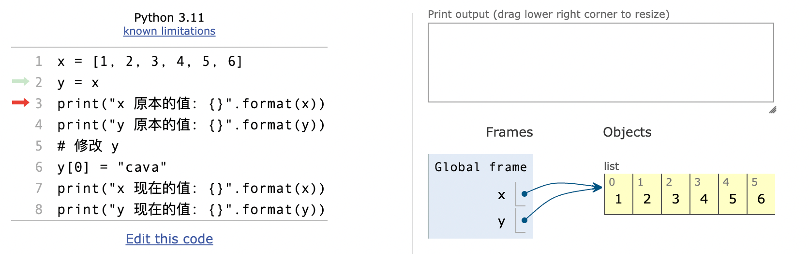
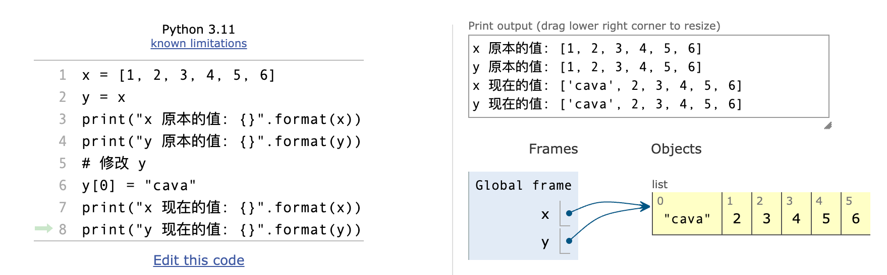
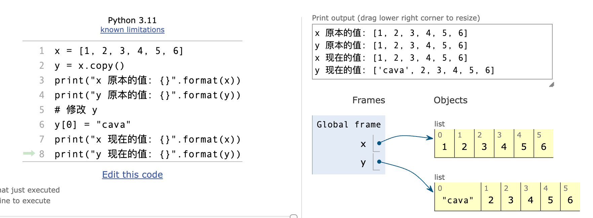

## 1. 问题

你好，我是悦创。

我们先来阅读下面的代码： 

```python
def remove_all(L, x):
    assert type(L) is list and x is not None
    for i in L:
        if i == x:
            print(f"i: {i}-L: {L}")
            L.remove(i)
        else:
            print(f"i: {i}-L: {L}")
            # pass
    return L


print(remove_all([9, 9, 1, 9, 8, 1], 9))
```

上面的代码无法得到正确结果：

```python
i: 9-L: [9, 9, 1, 9, 8, 1]
i: 1-L: [9, 1, 9, 8, 1]
i: 9-L: [9, 1, 9, 8, 1]
i: 1-L: [1, 9, 8, 1]
[1, 9, 8, 1]
```

::: tip 问题

为什么无法正确得到把数字 9 剔除之后的结果？

:::

## 2. 分析

**按正常逻辑：**

遍历一边目标列表，并判断是否是 x，并使用 remove 提出，这个整体思路是对的。但是在具体实施的时候，需要注意的是：

- 我们没有把列表进行 copy，所以是直接修改列表本身。
- 因为我们是直接修改列表本身，所以列表的长度是一直在变化的。
- 所以我们逐步分析其中过程，在分析我们需要查看三个参数变化：`L`、`remove()`、`i`

所以，修改代码如下：

```python
def remove_all(L, x):
    print(f"L 原始的数据为: {L}")
    for i in L:
        print(f"i 每次的值: {i}")
        if i == x:
            L.remove(i)
            print(f"L 删除 x 之后的列表数据: {L}")
        else:
            print(f"L 本次没有删除: {L}")
    print(f"L 最终的数据为: {L}")


remove_all([9, 99, 1, 9, 8, 1], 9)
```

## 3. 分析结论「详细分析」

在执行 `remove_all([9, 99, 1, 9, 8, 1], 9)` 时：

1. 初始列表为 `[9, 99, 1, 9, 8, 1]`。
2. 第一次循环时，`i` 的值为列表的第一个元素 `9`。因为 `i == 9`，函数将删除这个元素。此时列表变为 `[99, 1, 9, 8, 1]`。
3. 第二次循环时，由于第一个元素 `9` 被删除，所有后续元素向左移动一位。但是循环的索引也向前移动到了第二个元素，这时的第二个元素是原始列表的第三个元素 `1`。所以，`i` 的值变成了 `1` 而不是 `99`。「这也是跳过 99 的原因」
4. 第三次循环时，`i` 的值为 `9`（这是原始列表的第四个元素，但现在是新列表的第三个元素）。因为 `i == 9`，函数将删除这个元素。此时列表变为 `[99, 1, 8, 1]`。
5. 接下来的循环将不再遇到值为 `9` 的元素，因为所有的 `9` 已被删除。「后续跳过 8 也是这个原因」


## 4. 解决方法

1. 因为产生的原因，是列表改变引起的，本身整体逻辑是没有问题的，所以只要保证被循环的列表不会被改变即可。
2. 使用 copy 函数，copy 一个列表就可以解决了。


## 5. 列表深浅拷贝

### 5.1 现存问题

::: tip 问题

现在所存在的问题：单纯的修改 y 会影响 x 的值

:::

```python
x = [1, 2, 3, 4, 5, 6]
y = x
print("x 原本的值: {}".format(x))
print("y 原本的值: {}".format(y))
# 修改 y
y[0] = "cava"
print("x 现在的值: {}".format(x))
print("y 现在的值: {}".format(y))

# ---output---
x 原本的值: [1, 2, 3, 4, 5, 6]
y 原本的值: [1, 2, 3, 4, 5, 6]
x 现在的值: ['cava', 2, 3, 4, 5, 6]
y 现在的值: ['cava', 2, 3, 4, 5, 6]
```






### 5.2 浅拷贝 copy()

```python
x = [1, 2, 3, 4, 5, 6]
y = x.copy()
print("x 原本的值: {}".format(x))
print("y 原本的值: {}".format(y))
# 修改 y
y[0] = "cava"
print("x 现在的值: {}".format(x))
print("y 现在的值: {}".format(y))

# ---output---
x 原本的值: [1, 2, 3, 4, 5, 6]
y 原本的值: [1, 2, 3, 4, 5, 6]
x 现在的值: [1, 2, 3, 4, 5, 6]
y 现在的值: ['cava', 2, 3, 4, 5, 6]
```




为什么说它是浅拷贝呢？——因为，当列表出现嵌套的时候，就无能为力了。

```python
x = [1, 2, 3, 4, 5, 6, ["rxx", "nb", "good"]]
y = x.copy()
print("x 原本的值: {}".format(x))
print("y 原本的值: {}".format(y))
# 修改 y
y[0] = "cava"
y[6][1] = "Python"
print("x 现在的值: {}".format(x))
print("y 现在的值: {}".format(y))

# ---output---
x 原本的值: [1, 2, 3, 4, 5, 6, ['rxx', 'nb', 'good']]
y 原本的值: [1, 2, 3, 4, 5, 6, ['rxx', 'nb', 'good']]
x 现在的值: [1, 2, 3, 4, 5, 6, ['rxx', 'Python', 'good']]
y 现在的值: ['cava', 2, 3, 4, 5, 6, ['rxx', 'Python', 'good']]
```

因为，上面的 copy 只 copy 了第一层列表，嵌套的列表或者其他就没有完全拷贝了。

如何解决呢？

### 5.3 深拷贝 deepcopy()

```python
from copy import deepcopy
x = [1, 2, 3, 4, 5, 6, ["rxx", "nb", "good"]]
y = deepcopy(x)
print("x 原本的值: {}".format(x))
print("y 原本的值: {}".format(y))
# 修改 y
y[0] = "cava"
y[6][1] = "Python"
print("x 现在的值: {}".format(x))
print("y 现在的值: {}".format(y))

# ---output---
x 原本的值: [1, 2, 3, 4, 5, 6, ['rxx', 'nb', 'good']]
y 原本的值: [1, 2, 3, 4, 5, 6, ['rxx', 'nb', 'good']]
x 现在的值: [1, 2, 3, 4, 5, 6, ['rxx', 'nb', 'good']]
y 现在的值: ['cava', 2, 3, 4, 5, 6, ['rxx', 'Python', 'good']]
```


### 5.4 code

```python
x = [1, 2, 3, 4, 5, 6]
y = x
print("x 原本的值: {}".format(x))
print("y 原本的值: {}".format(y))
# 修改 y
y[0] = "cava"
print("x 现在的值: {}".format(x))
print("y 现在的值: {}".format(y))
# 现在所存在的问题：单纯的修改 y 会影响 x 的值
# 如何解决问题？——copy()
print("-*-" * 8)
x = [1, 2, 3, 4, 5, 6]
y = x.copy()
print("x 原本的值: {}".format(x))
print("y 原本的值: {}".format(y))
# 修改 y
y[0] = "cava"
print("x 现在的值: {}".format(x))
print("y 现在的值: {}".format(y))
print("-*-" * 8)
# 当列表里面出现嵌套的时候，copy 只能 copy 第一层
x = [1, 2, 3, 4, 5, 6, ["rxx", "nb", "good"]]
y = x.copy()
print("x 原本的值: {}".format(x))
print("y 原本的值: {}".format(y))
# 修改 y
y[0] = "cava"
y[6][1] = "Python"
print("x 现在的值: {}".format(x))
print("y 现在的值: {}".format(y))
print("-*-" * 8)
from copy import deepcopy
x = [1, 2, 3, 4, 5, 6, ["rxx", "nb", "good"]]
y = deepcopy(x)
print("x 原本的值: {}".format(x))
print("y 原本的值: {}".format(y))
# 修改 y
y[0] = "cava"
y[6][1] = "Python"
print("x 现在的值: {}".format(x))
print("y 现在的值: {}".format(y))


# ---output---
x 原本的值: [1, 2, 3, 4, 5, 6]
y 原本的值: [1, 2, 3, 4, 5, 6]
x 现在的值: ['cava', 2, 3, 4, 5, 6]
y 现在的值: ['cava', 2, 3, 4, 5, 6]
-*--*--*--*--*--*--*--*-
x 原本的值: [1, 2, 3, 4, 5, 6]
y 原本的值: [1, 2, 3, 4, 5, 6]
x 现在的值: [1, 2, 3, 4, 5, 6]
y 现在的值: ['cava', 2, 3, 4, 5, 6]
-*--*--*--*--*--*--*--*-
x 原本的值: [1, 2, 3, 4, 5, 6, ['rxx', 'nb', 'good']]
y 原本的值: [1, 2, 3, 4, 5, 6, ['rxx', 'nb', 'good']]
x 现在的值: [1, 2, 3, 4, 5, 6, ['rxx', 'Python', 'good']]
y 现在的值: ['cava', 2, 3, 4, 5, 6, ['rxx', 'Python', 'good']]
-*--*--*--*--*--*--*--*-
x 原本的值: [1, 2, 3, 4, 5, 6, ['rxx', 'nb', 'good']]
y 原本的值: [1, 2, 3, 4, 5, 6, ['rxx', 'nb', 'good']]
x 现在的值: [1, 2, 3, 4, 5, 6, ['rxx', 'nb', 'good']]
y 现在的值: ['cava', 2, 3, 4, 5, 6, ['rxx', 'Python', 'good']]
```

## 6. 解决上面的问题代码


欢迎关注我公众号：AI悦创，有更多更好玩的等你发现！

::: details 公众号：AI悦创【二维码】


:::

::: info AI悦创·编程一对一

AI悦创·推出辅导班啦，包括「Python 语言辅导班、C++ 辅导班、java 辅导班、算法/数据结构辅导班、少儿编程、pygame 游戏开发」，全部都是一对一教学：一对一辅导 + 一对一答疑 + 布置作业 + 项目实践等。当然，还有线下线上摄影课程、Photoshop、Premiere 一对一教学、QQ、微信在线，随时响应！微信：Jiabcdefh

C++ 信息奥赛题解，长期更新！长期招收一对一中小学信息奥赛集训，莆田、厦门地区有机会线下上门，其他地区线上。微信：Jiabcdefh

方法一：[QQ](http://wpa.qq.com/msgrd?v=3&uin=1432803776&site=qq&menu=yes)

方法二：微信：Jiabcdefh

:::


